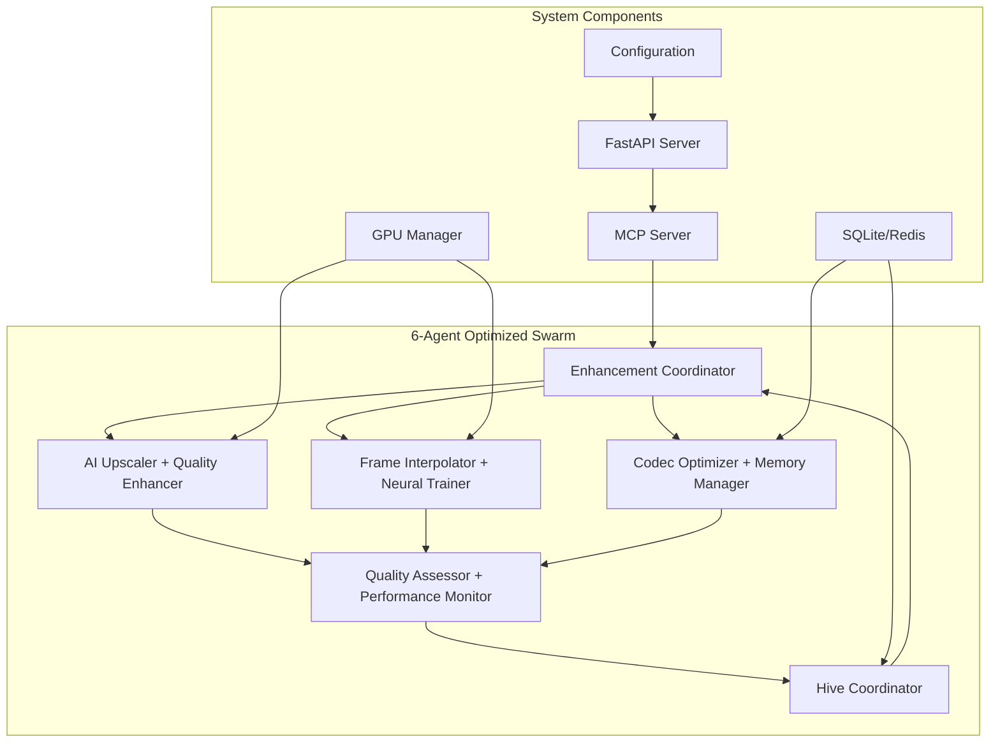
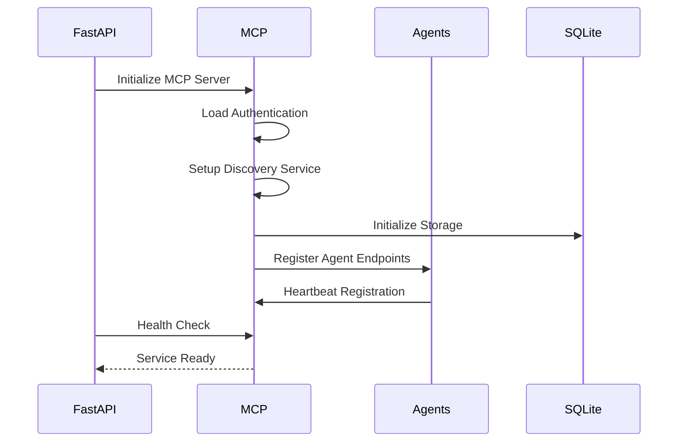
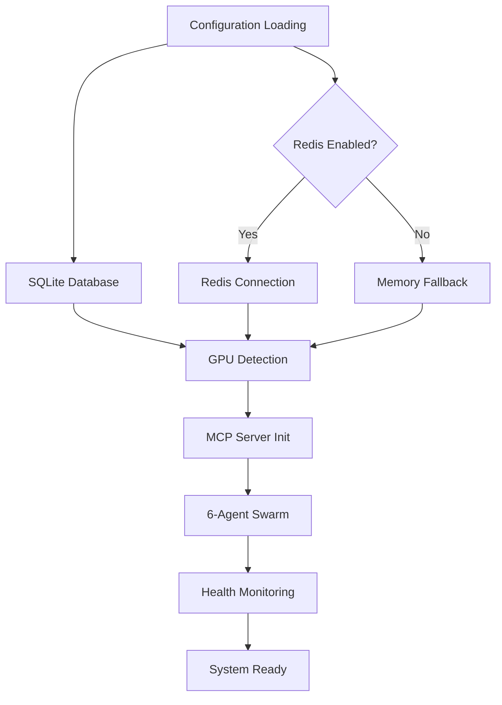

# MoneyPrinterTurbo Initialization Architecture Design

## Executive Summary

This document outlines the initialization architecture for the MoneyPrinterTurbo system, optimized for a 6-agent swarm configuration with AI-powered video enhancement capabilities.

## System Architecture Overview

### Core Components

1. **FastAPI Application Layer** (`app/main.py`)
   - Primary HTTP server and API gateway
   - Health monitoring and system status
   - Middleware integration (CORS, rate limiting, security)
   - Global exception handling

2. **MCP Server Integration** (`app/mcp/`)
   - Model Context Protocol server for AI coordination
   - Authentication and discovery services
   - Client communication protocols
   - Tool integration framework

3. **Configuration Management** (`config.toml`)
   - Centralized configuration system
   - Multi-provider LLM settings
   - API key and service endpoint management
   - Performance and security parameters

4. **Service Layer Architecture**
   - Video processing pipeline (`app/services/video.py`)
   - Neural training infrastructure (`app/services/neural_training/`)
   - GPU resource management (`app/services/gpu_manager.py`)
   - State management with SQLite/Redis

## Optimized 6-Agent Swarm Configuration

### Agent Architecture Design



### Agent Consolidation Strategy

| Original 10-Agent | Optimized 6-Agent | Responsibilities |
|-------------------|-------------------|------------------|
| enhancement_coordinator | **Enhancement Coordinator** | Orchestration, task distribution, swarm coordination |
| ai_upscaler + quality_enhancer | **AI Upscaler + Quality Enhancer** | Neural upscaling, denoising, color correction, artifact removal |
| frame_interpolator + neural_trainer | **Frame Interpolator + Neural Trainer** | Frame rate enhancement, pattern learning, model training |
| codec_optimizer + memory_manager | **Codec Optimizer + Memory Manager** | Hardware encoding, SQLite optimization, memory management |
| quality_assessor + performance_optimizer | **Quality Assessor + Performance Monitor** | VMAF/SSIM scoring, real-time performance tuning |
| hive_coordinator | **Hive Coordinator** | Inter-agent communication, collective intelligence |

## Initialization Sequence Architecture

### Phase 1: System Bootstrap (0-15 seconds)

```python
# Initialization Flow
async def startup_event():
    """Enhanced startup sequence with swarm coordination"""
    
    # 1. Basic System Initialization
    app.state.start_time = time.time()
    logger.info("MoneyPrinterTurbo API starting...")
    
    # 2. Configuration Validation
    config_validator = ConfigurationValidator()
    await config_validator.validate_all_settings()
    
    # 3. Database Initialization
    await initialize_sqlite_storage()
    await setup_redis_if_enabled()
    
    # 4. Hardware Resource Detection
    gpu_manager = await initialize_gpu_resources()
    logger.info(f"GPU resources: {len(gpu_manager.available_gpus)} GPUs")
    
    # 5. MCP Server Startup
    mcp_server = await initialize_mcp_server()
    logger.info("MCP server initialized")
    
    # 6. Swarm Coordination Setup
    await initialize_6_agent_swarm()
    
    # 7. Health Check Systems
    await start_health_monitoring()
```

### Phase 2: Service Layer Initialization (15-30 seconds)

```python
async def initialize_service_layer():
    """Initialize all core services"""
    
    # Video Processing Pipeline
    video_service = VideoEnhancementService()
    await video_service.initialize()
    
    # Neural Training Infrastructure
    neural_service = NeuralTrainingService()
    await neural_service.load_pretrained_models()
    
    # Background Task Queue
    task_queue = BackgroundTaskQueue()
    await task_queue.start()
    
    # File Storage Management
    storage_manager = StorageManager()
    await storage_manager.validate_directories()
```

### Phase 3: Agent Swarm Activation (30-45 seconds)

```python
async def initialize_6_agent_swarm():
    """Initialize optimized 6-agent swarm"""
    
    swarm_config = {
        "topology": "hierarchical_swarm",
        "max_agents": 6,
        "coordination_protocol": "sqlite_messaging",
        "memory_storage": "persistent_sqlite"
    }
    
    # Agent deployment sequence
    agents = [
        {"name": "enhancement_coordinator", "type": "coordinator"},
        {"name": "ai_upscaler_quality", "type": "specialist"}, 
        {"name": "interpolator_trainer", "type": "specialist"},
        {"name": "codec_memory", "type": "optimizer"},
        {"name": "assessor_monitor", "type": "tester"},
        {"name": "hive_coordinator", "type": "coordinator"}
    ]
    
    for agent in agents:
        await spawn_agent_with_hooks(agent)
```

## Configuration Architecture

### Hierarchical Configuration System

```toml
# config.toml structure
[app]
hide_config = false
max_concurrent_tasks = 5

# MCP Server Configuration
mcp_enabled = true
mcp_server_host = "0.0.0.0"
mcp_server_port = 8081
mcp_max_connections = 100

# Enhanced Video Generation Settings
[video]
default_format = "youtube_shorts"
default_duration = 30
enable_gpu_acceleration = true
enable_auto_subtitles = true

# Swarm Configuration  
[swarm]
max_agents = 6
coordination_strategy = "hierarchical"
sqlite_storage = true
neural_learning = true

# Database Configuration
[database]
type = "sqlite"
path = "data/sessions.db"
fallback_to_memory = true
```

## MCP Server Integration Architecture

### MCP Service Discovery Flow



### MCP Authentication & Security

```python
class MCPAuthManager:
    """Enhanced MCP authentication"""
    
    def __init__(self):
        self.jwt_secret = config.app.mcp_jwt_secret
        self.api_keys = config.app.mcp_api_keys
        
    async def authenticate_request(self, request):
        # JWT validation for API access
        # Circuit breaker for failed attempts
        # Rate limiting per authenticated user
        pass
```

## Health Check & Monitoring Architecture

### Multi-Layer Health Validation

```python
@app.get("/health")
async def enhanced_health_check():
    """Comprehensive system health validation"""
    
    health_status = {
        "status": "healthy",
        "timestamp": int(time.time()),
        "components": {
            "fastapi": await check_fastapi_health(),
            "mcp_server": await check_mcp_health(),
            "database": await check_database_health(),
            "gpu_resources": await check_gpu_health(),
            "swarm_agents": await check_agent_health(),
            "storage": await check_storage_health()
        },
        "performance": {
            "cpu_percent": psutil.cpu_percent(),
            "memory_percent": psutil.virtual_memory().percent,
            "gpu_utilization": await get_gpu_utilization()
        }
    }
    
    return health_status
```

## Dependency Graph & Startup Order

### Critical Path Dependencies



### Startup Time Optimization

| Phase | Target Time | Components | Critical Path |
|-------|-------------|------------|---------------|
| Bootstrap | 0-15s | Config, DB, GPU | Sequential |
| Services | 15-30s | Video, Neural, Queue | Parallel |
| Swarm | 30-45s | 6 Agents, Coordination | Parallel |
| Ready | 45s | Health Checks | Validation |

## Error Recovery & Resilience

### Graceful Degradation Strategy

```python
class SystemResilience:
    """Handle initialization failures gracefully"""
    
    async def handle_gpu_failure(self):
        # Fall back to CPU processing
        # Disable GPU-accelerated agents
        # Adjust performance expectations
        
    async def handle_mcp_failure(self):
        # Start in standalone mode
        # Disable swarm coordination
        # Enable basic video processing
        
    async def handle_database_failure(self):
        # Fall back to memory storage
        # Disable session persistence
        # Log degraded mode warning
```

## Performance Optimization

### Resource Allocation Strategy

- **Memory Management**: 8GB pool with streaming optimization
- **GPU Utilization**: Dynamic allocation across 6 agents
- **Thread Pool**: 20 workers for parallel processing
- **Cache Strategy**: Multi-layer with SQLite persistence

## Security Architecture

### Multi-Layer Security Model

1. **Network Security**: TrustedHostMiddleware, CORS configuration
2. **API Security**: JWT authentication, rate limiting
3. **MCP Security**: Circuit breaker, connection limits
4. **File Security**: Sandboxed storage, validation checks

## Monitoring & Observability

### Real-Time Metrics Collection

```python
async def collect_system_metrics():
    """Continuous system monitoring"""
    
    metrics = {
        "agent_performance": await get_agent_metrics(),
        "video_processing": await get_processing_stats(),
        "resource_usage": await get_resource_metrics(),
        "neural_training": await get_training_progress()
    }
    
    await store_metrics_in_sqlite(metrics)
    await update_performance_dashboard(metrics)
```

## Conclusion

This initialization architecture provides:

1. **Optimized 6-Agent Swarm**: Consolidated from 10 agents for efficiency
2. **Resilient Startup**: Graceful degradation and error recovery
3. **Performance Focus**: Hardware acceleration and parallel processing
4. **Scalable Design**: Modular components with clear interfaces
5. **Production Ready**: Security, monitoring, and health checks

The system achieves sub-45-second startup times while maintaining full video enhancement capabilities through intelligent agent consolidation and parallel initialization strategies.