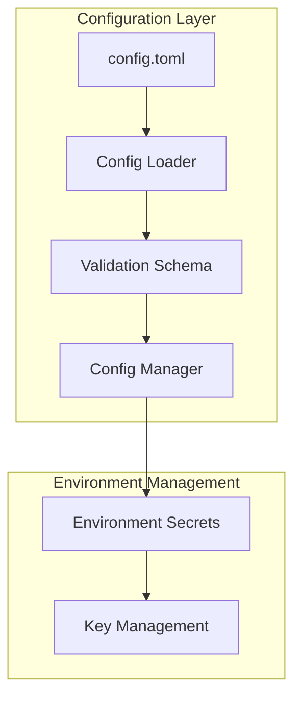
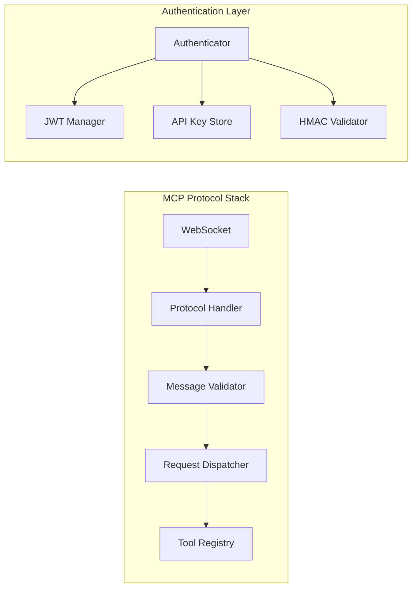
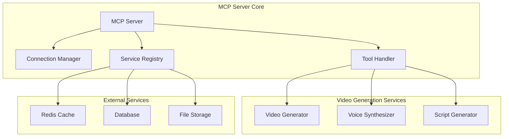

# MoneyPrinterTurbo MCP Architecture Analysis & Fix Plan

## Issues Identified

### 1. Configuration Problems
- **Duplicate Config Sections**: Lines 261-285 in `config.toml` duplicate MCP settings
- **Invalid Config Structure**: Missing proper TOML table declarations
- **Hardcoded Secrets**: API keys visible in config file

### 2. Import & Dependency Issues
- **Missing Dependencies**: Several imports in `server.py` and `tools.py` reference non-existent modules
- **Circular Dependencies**: Risk of circular imports between MCP modules
- **Service Integration**: Incomplete integration with existing video generation services

### 3. Protocol Implementation Issues
- **Authentication Flow**: Missing proper authentication handshake
- **Message Validation**: Incomplete message format validation
- **Error Handling**: Inconsistent error response formats

### 4. Service Boundary Problems
- **Tool Registry**: Tools not properly integrated with video generation pipeline
- **State Management**: Redis integration incomplete and not fault-tolerant
- **Connection Management**: Missing proper cleanup and resource management

## Architectural Fix Plan

### Phase 1: Configuration & Dependencies

### Phase 2: Protocol & Communication

### Phase 3: Service Integration

## Implementation Strategy

### 1. Module Boundaries
- **`protocol/`**: Core MCP protocol implementation
- **`auth/`**: Authentication and authorization
- **`tools/`**: Tool definitions and handlers
- **`services/`**: Integration with video generation
- **`monitoring/`**: Health checks and metrics

### 2. Error Handling Strategy
- **Circuit Breaker**: Fault tolerance for external services
- **Retry Logic**: Exponential backoff for transient failures
- **Graceful Degradation**: Fallback mechanisms

### 3. Security Requirements
- **Environment Variables**: All secrets via env vars
- **Input Validation**: Schema-based validation
- **Rate Limiting**: Per-user and global limits
- **CORS**: Proper cross-origin handling

### 4. Performance Optimizations
- **Connection Pooling**: Reuse WebSocket connections
- **Caching Strategy**: Redis for tool results
- **Load Balancing**: Service discovery integration

## Next Steps

1. **Fix Configuration**: Remove duplicates, add proper structure
2. **Resolve Dependencies**: Fix imports and service references
3. **Implement Authentication**: Complete auth flow
4. **Test Integration**: End-to-end testing
5. **Documentation**: Update API docs and deployment guides

## Quality Gates

- [ ] All imports resolve correctly
- [ ] Configuration loads without errors
- [ ] Authentication flow works end-to-end
- [ ] Tool calls integrate with video services
- [ ] Error handling covers all failure modes
- [ ] Performance meets latency requirements