# API Interfaces and Service Boundaries Specification

## Executive Summary

This document defines comprehensive API interfaces, service boundaries, and communication contracts for the MoneyPrinterTurbo microservices architecture. It establishes clear protocols for inter-service communication, data formats, error handling, and versioning strategies to ensure loose coupling and high cohesion.

## Service Boundary Overview

### Service Communication Matrix

```mermaid
graph TB
    %% External Layer
    Client[👤 Client Applications]
    
    %% API Gateway
    Client --> Gateway[🛡️ API Gateway<br/>Port: 8080]
    
    %% Core Services
    Gateway --> VideoOrch[🎬 Video Orchestrator<br/>Port: 8081]
    Gateway --> AudioSvc[🎵 Audio Service<br/>Port: 8082]
    Gateway --> ContentSvc[📝 Content Service<br/>Port: 8083]
    Gateway --> UserSvc[👤 User Service<br/>Port: 8084]
    
    %% Processing Services
    VideoOrch --> ValidationSvc[✅ Validation Service<br/>Port: 8085]
    VideoOrch --> ProcessingSvc[⚙️ Processing Service<br/>Port: 8086]
    VideoOrch --> ConcatSvc[🔗 Concatenation Service<br/>Port: 8087]
    VideoOrch --> RenderingSvc[🎨 Rendering Service<br/>Port: 8088]
    
    %% Infrastructure Services
    Gateway --> ConfigSvc[⚙️ Config Service<br/>Port: 8089]
    VideoOrch --> MonitoringSvc[📊 Monitoring Service<br/>Port: 8090]
    ProcessingSvc --> StorageSvc[💾 Storage Service<br/>Port: 8091]
    
    %% Message Queue
    VideoOrch -.-> Queue[📨 Message Queue<br/>Async Events]
    ProcessingSvc -.-> Queue
    AudioSvc -.-> Queue
    ConcatSvc -.-> Queue
    
    %% Data Services
    UserSvc --> Database[(🗄️ PostgreSQL<br/>Port: 5432)]
    ConfigSvc --> Vault[(🔐 Vault<br/>Port: 8200)]
    MonitoringSvc --> Redis[(⚡ Redis<br/>Port: 6379)]
    StorageSvc --> ObjectStore[(📁 Object Storage)]
    
    classDef external fill:#fff3e0,stroke:#f57c00,stroke-width:2px
    classDef core fill:#e1f5fe,stroke:#0277bd,stroke-width:2px
    classDef processing fill:#e8f5e8,stroke:#388e3c,stroke-width:2px
    classDef infra fill:#f3e5f5,stroke:#7b1fa2,stroke-width:2px
    classDef data fill:#fff8e1,stroke:#f57f17,stroke-width:2px
    
    class Client,Gateway external
    class VideoOrch,AudioSvc,ContentSvc,UserSvc core
    class ValidationSvc,ProcessingSvc,ConcatSvc,RenderingSvc processing
    class ConfigSvc,MonitoringSvc,StorageSvc infra
    class Database,Vault,Redis,ObjectStore,Queue data
```



## API Design Principles

### RESTful API Standards

**Base URL Structure**: `https://api.moneyprinterturbo.com/v1`

**HTTP Method Conventions**:
- `GET` - Retrieve resources (idempotent)
- `POST` - Create new resources
- `PUT` - Update entire resources (idempotent)
- `PATCH` - Partial resource updates
- `DELETE` - Remove resources (idempotent)

**Response Format Standards**:
```json
{
  "success": true,
  "data": { /* resource data */ },
  "meta": {
    "timestamp": "2025-01-29T10:00:00Z",
    "version": "v1",
    "request_id": "req_12345abc"
  },
  "errors": null
}
```

**Error Response Format**:
```json
{
  "success": false,
  "data": null,
  "meta": {
    "timestamp": "2025-01-29T10:00:00Z",
    "version": "v1",
    "request_id": "req_12345abc"
  },
  "errors": [
    {
      "code": "VALIDATION_ERROR",
      "message": "Invalid input parameters",
      "field": "clips",
      "details": "At least one video clip is required"
    }
  ]
}
```

## 1. API Gateway Service Interface

### Gateway External API

**Base Path**: `/api/v1`

#### Authentication Endpoints

```http
POST /auth/login
Content-Type: application/json

{
  "email": "user@example.com",
  "password": "secure_password",
  "mfa_code": "123456"
}

Response:
{
  "success": true,
  "data": {
    "access_token": "eyJhbGciOiJSUzI1NiIs...",
    "refresh_token": "eyJhbGciOiJSUzI1NiIs...",
    "expires_in": 900,
    "user": {
      "id": "user_12345",
      "email": "user@example.com",
      "roles": ["user"],
      "permissions": ["video.create", "video.read"]
    }
  }
}
```

```http
POST /auth/refresh
Content-Type: application/json
Authorization: Bearer {refresh_token}

{
  "refresh_token": "eyJhbGciOiJSUzI1NiIs..."
}

Response:
{
  "success": true,
  "data": {
    "access_token": "eyJhbGciOiJSUzI1NiIs...",
    "expires_in": 900
  }
}
```

#### Video Processing Endpoints

```http
POST /videos
Content-Type: application/json
Authorization: Bearer {access_token}

{
  "title": "My Video Project",
  "clips": [
    {
      "url": "https://storage.example.com/clip1.mp4",
      "start_time": 10.5,
      "end_time": 30.0,
      "metadata": {
        "source": "upload",
        "original_name": "clip1.mp4"
      }
    }
  ],
  "audio": {
    "script": "This is the narration text for the video",
    "voice": {
      "provider": "openai",
      "voice_id": "en-US-Standard-A",
      "speed": 1.0,
      "pitch": 0.0
    },
    "background_music": {
      "enabled": true,
      "track": "upbeat",
      "volume": 0.3
    }
  },
  "settings": {
    "resolution": "1080p",
    "aspect_ratio": "16:9",
    "quality": "high",
    "format": "mp4"
  }
}

Response:
{
  "success": true,
  "data": {
    "job_id": "vid_12345abc",
    "status": "processing",
    "progress": 0,
    "estimated_completion": "2025-01-29T10:30:00Z",
    "progress_url": "/videos/vid_12345abc/status",
    "webhook_url": null
  }
}
```

```http
GET /videos/{job_id}/status
Authorization: Bearer {access_token}

Response:
{
  "success": true,
  "data": {
    "job_id": "vid_12345abc",
    "status": "processing",
    "progress": 65,
    "stages": {
      "validation": {
        "status": "completed",
        "completed_at": "2025-01-29T10:05:00Z"
      },
      "audio_generation": {
        "status": "completed", 
        "completed_at": "2025-01-29T10:15:00Z"
      },
      "video_processing": {
        "status": "in_progress",
        "progress": 75,
        "estimated_completion": "2025-01-29T10:25:00Z"
      },
      "concatenation": {
        "status": "pending"
      },
      "rendering": {
        "status": "pending"
      }
    },
    "result": null,
    "error": null
  }
}
```

### Gateway Internal Service Routing

**Service Discovery Configuration**:
```yaml
services:
  video-orchestrator:
    base_url: "http://video-orchestrator:8081"
    health_check: "/health"
    timeout: 30s
    
  audio-service:
    base_url: "http://audio-service:8082"
    health_check: "/health"
    timeout: 60s
    
  user-service:
    base_url: "http://user-service:8084"
    health_check: "/health"
    timeout: 10s
```

## 2. Video Orchestrator Service Interface

### Video Orchestrator API

**Base Path**: `/orchestrator/v1`

#### Workflow Management

```http
POST /workflows
Content-Type: application/json
X-Request-ID: req_12345abc
X-User-ID: user_12345

{
  "workflow_type": "video_generation",
  "input": {
    "clips": [...],
    "audio": {...},
    "settings": {...}
  },
  "priority": "normal",
  "callback_url": "https://api.example.com/webhooks/video-complete"
}

Response:
{
  "success": true,
  "data": {
    "workflow_id": "wf_67890def",
    "status": "queued",
    "created_at": "2025-01-29T10:00:00Z",
    "estimated_duration": 1800
  }
}
```

```http
GET /workflows/{workflow_id}
X-Request-ID: req_12345abc

Response:
{
  "success": true,
  "data": {
    "workflow_id": "wf_67890def",
    "status": "processing",
    "progress": {
      "overall": 45,
      "current_stage": "video_processing",
      "stages": {
        "validation": {"status": "completed", "duration": 5},
        "audio_generation": {"status": "completed", "duration": 120},
        "video_processing": {"status": "in_progress", "progress": 60},
        "concatenation": {"status": "pending"},
        "rendering": {"status": "pending"}
      }
    },
    "resource_usage": {
      "cpu_cores": 4,
      "memory_mb": 2048,
      "gpu_utilization": 75
    },
    "estimated_completion": "2025-01-29T10:25:00Z"
  }
}
```

#### Task Management

```http
POST /tasks
Content-Type: application/json

{
  "workflow_id": "wf_67890def",
  "task_type": "video_processing",
  "input_data": {
    "clips": [...],
    "target_format": "mp4",
    "quality_settings": {...}
  },
  "dependencies": ["task_audio_generation"],
  "timeout": 600
}

Response:
{
  "success": true,
  "data": {
    "task_id": "task_abc123",
    "status": "queued",
    "priority": 5,
    "created_at": "2025-01-29T10:00:00Z"
  }
}
```

## 3. Audio Service Interface

### Audio Processing API

**Base Path**: `/audio/v1`

#### Text-to-Speech

```http
POST /tts/synthesize
Content-Type: application/json

{
  "text": "This is the narration text for the video",
  "voice": {
    "provider": "openai",
    "voice_id": "en-US-Standard-A",
    "language": "en-US"
  },
  "settings": {
    "speed": 1.0,
    "pitch": 0.0,
    "volume": 1.0,
    "format": "mp3",
    "sample_rate": 44100
  },
  "options": {
    "use_cache": true,
    "fallback_providers": ["google", "azure"]
  }
}

Response:
{
  "success": true,
  "data": {
    "audio_id": "audio_xyz789",
    "duration": 15.5,
    "format": "mp3",
    "sample_rate": 44100,
    "url": "https://storage.example.com/audio/audio_xyz789.mp3",
    "metadata": {
      "provider_used": "openai",
      "generated_at": "2025-01-29T10:00:00Z",
      "text_length": 42,
      "cache_hit": false
    }
  }
}
```

#### Audio Mixing

```http
POST /mix
Content-Type: application/json

{
  "tracks": [
    {
      "type": "voice",
      "url": "https://storage.example.com/audio/voice.mp3",
      "volume": 1.0,
      "start_time": 0.0
    },
    {
      "type": "background",
      "url": "https://storage.example.com/audio/bgm.mp3",
      "volume": 0.3,
      "start_time": 0.0,
      "fade_in": 2.0,
      "fade_out": 2.0
    }
  ],
  "output": {
    "format": "mp3",
    "duration": 120.0,
    "sample_rate": 44100
  },
  "effects": {
    "normalize": true,
    "noise_reduction": true,
    "auto_ducking": true
  }
}

Response:
{
  "success": true,
  "data": {
    "mix_id": "mix_def456",
    "duration": 120.0,
    "format": "mp3",
    "url": "https://storage.example.com/audio/mix_def456.mp3",
    "processing_time": 8.5
  }
}
```

### Audio Service Provider Interface

```http
GET /providers/status
Response:
{
  "success": true,
  "data": {
    "providers": [
      {
        "name": "openai",
        "status": "healthy",
        "latency_ms": 250,
        "success_rate": 99.5,
        "rate_limit_remaining": 150
      },
      {
        "name": "google",
        "status": "healthy",
        "latency_ms": 180,
        "success_rate": 98.8,
        "rate_limit_remaining": 800
      },
      {
        "name": "azure",
        "status": "degraded",
        "latency_ms": 500,
        "success_rate": 95.2,
        "rate_limit_remaining": 50
      }
    ]
  }
}
```

## 4. Processing Service Interface

### Video Processing API

**Base Path**: `/processing/v1`

#### Clip Processing

```http
POST /clips/process
Content-Type: application/json

{
  "clips": [
    {
      "id": "clip_001",
      "url": "https://storage.example.com/raw/clip1.mp4",
      "processing": {
        "start_time": 10.0,
        "end_time": 30.0,
        "target_resolution": "1920x1080",
        "target_format": "mp4",
        "quality": "high"
      }
    }
  ],
  "batch_settings": {
    "parallel_processing": true,
    "max_concurrent": 4,
    "timeout_per_clip": 300
  }
}

Response:
{
  "success": true,
  "data": {
    "batch_id": "batch_789ghi",
    "status": "processing",
    "clips": [
      {
        "id": "clip_001",
        "status": "processing",
        "progress": 25,
        "estimated_completion": "2025-01-29T10:15:00Z"
      }
    ],
    "overall_progress": 25
  }
}
```

```http
GET /clips/process/{batch_id}
Response:
{
  "success": true,
  "data": {
    "batch_id": "batch_789ghi",
    "status": "completed",
    "clips": [
      {
        "id": "clip_001",
        "status": "completed",
        "progress": 100,
        "output_url": "https://storage.example.com/processed/clip_001.mp4",
        "metadata": {
          "duration": 20.0,
          "resolution": "1920x1080",
          "format": "mp4",
          "file_size": 52428800,
          "processing_time": 45.2
        }
      }
    ],
    "overall_progress": 100,
    "completed_at": "2025-01-29T10:15:32Z"
  }
}
```

## 5. Event-Driven Communication

### Message Queue Event Schemas

#### Video Processing Events

```json
// Event: video.processing.started
{
  "event_id": "evt_12345abc",
  "event_type": "video.processing.started",
  "version": "1.0",
  "timestamp": "2025-01-29T10:00:00Z",
  "source": "video-orchestrator",
  "data": {
    "workflow_id": "wf_67890def",
    "user_id": "user_12345",
    "job_id": "vid_12345abc",
    "input": {
      "clips_count": 3,
      "total_duration": 120.0,
      "target_resolution": "1920x1080"
    },
    "estimated_completion": "2025-01-29T10:30:00Z"
  }
}
```

```json
// Event: video.stage.completed
{
  "event_id": "evt_23456bcd",
  "event_type": "video.stage.completed",
  "version": "1.0",
  "timestamp": "2025-01-29T10:15:00Z",
  "source": "audio-service",
  "data": {
    "workflow_id": "wf_67890def",
    "stage": "audio_generation",
    "status": "completed",
    "duration": 120.5,
    "output": {
      "audio_id": "audio_xyz789",
      "url": "https://storage.example.com/audio/audio_xyz789.mp3",
      "duration": 118.3
    },
    "performance": {
      "processing_time": 8.2,
      "provider_used": "openai"
    }
  }
}
```

```json
// Event: video.processing.completed
{
  "event_id": "evt_34567cde",
  "event_type": "video.processing.completed",
  "version": "1.0",
  "timestamp": "2025-01-29T10:25:30Z",
  "source": "video-orchestrator",
  "data": {
    "workflow_id": "wf_67890def",
    "job_id": "vid_12345abc",
    "status": "completed",
    "output": {
      "video_url": "https://storage.example.com/output/vid_12345abc.mp4",
      "duration": 118.3,
      "file_size": 157286400,
      "resolution": "1920x1080",
      "format": "mp4"
    },
    "performance": {
      "total_processing_time": 1650.8,
      "stages": {
        "validation": {"duration": 2.1},
        "audio_generation": {"duration": 8.2},
        "video_processing": {"duration": 1580.5},
        "concatenation": {"duration": 45.3},
        "rendering": {"duration": 14.7}
      }
    },
    "resources": {
      "peak_memory_mb": 2048,
      "cpu_hours": 0.85,
      "gpu_hours": 1.2
    }
  }
}
```

```json
// Event: video.processing.failed
{
  "event_id": "evt_45678def",
  "event_type": "video.processing.failed",
  "version": "1.0",
  "timestamp": "2025-01-29T10:20:15Z",
  "source": "processing-service",
  "data": {
    "workflow_id": "wf_67890def",
    "job_id": "vid_12345abc",
    "stage": "video_processing",
    "error": {
      "code": "PROCESSING_ERROR",
      "message": "Video codec not supported",
      "details": "Input video codec 'av1' is not supported",
      "retry_count": 2,
      "max_retries": 3
    },
    "context": {
      "clip_id": "clip_002",
      "input_url": "https://storage.example.com/raw/clip2.mp4"
    }
  }
}
```

### Event Publishing Patterns

```http
POST /events/publish
Content-Type: application/json
X-Service-Name: video-orchestrator

{
  "topic": "video.processing",
  "event": {
    "event_type": "video.processing.started",
    "data": { ... }
  },
  "routing_key": "video.processing.started",
  "delivery_mode": "persistent",
  "priority": 5
}
```

## 6. Service-to-Service Authentication

### JWT Service Tokens

**Service Token Format**:
```json
{
  "iss": "moneyprinterturbo-auth",
  "sub": "service:video-orchestrator",
  "aud": ["processing-service", "audio-service"],
  "exp": 1706524800,
  "iat": 1706521200,
  "scope": "video.process audio.generate",
  "service_id": "video-orchestrator",
  "permissions": [
    "processing:clips:create",
    "processing:clips:read",
    "audio:tts:create",
    "audio:mix:create"
  ]
}
```

**Service Authentication Flow**:
```http
POST /auth/service/token
Content-Type: application/json

{
  "service_id": "video-orchestrator",
  "client_secret": "${SERVICE_SECRET}",
  "scope": "video.process audio.generate"
}

Response:
{
  "access_token": "eyJhbGciOiJSUzI1NiIs...",
  "token_type": "Bearer",
  "expires_in": 3600,
  "scope": "video.process audio.generate"
}
```

## 7. Error Handling and Status Codes

### HTTP Status Code Standards

| Status Code | Usage | Description |
|-------------|-------|-------------|
| **200** | Success | Request completed successfully |
| **201** | Created | Resource created successfully |
| **202** | Accepted | Request accepted for async processing |
| **400** | Bad Request | Invalid request format or parameters |
| **401** | Unauthorized | Authentication required or failed |
| **403** | Forbidden | Insufficient permissions |
| **404** | Not Found | Resource not found |
| **409** | Conflict | Resource conflict (duplicate, etc.) |
| **422** | Unprocessable Entity | Validation errors |
| **429** | Too Many Requests | Rate limit exceeded |
| **500** | Internal Server Error | Unexpected server error |
| **502** | Bad Gateway | Downstream service error |
| **503** | Service Unavailable | Service temporarily unavailable |
| **504** | Gateway Timeout | Downstream service timeout |

### Error Response Schema

```json
{
  "success": false,
  "data": null,
  "meta": {
    "timestamp": "2025-01-29T10:00:00Z",
    "version": "v1",
    "request_id": "req_12345abc",
    "trace_id": "trace_67890def"
  },
  "errors": [
    {
      "code": "VALIDATION_ERROR",
      "message": "Invalid input parameters",
      "field": "clips[0].url",
      "details": "URL must be a valid HTTPS endpoint",
      "help_url": "https://docs.moneyprinterturbo.com/errors/validation-error"
    }
  ]
}
```

### Service-Specific Error Codes

**Video Processing Service**:
- `VIDEO_FORMAT_UNSUPPORTED` - Video format not supported
- `VIDEO_CORRUPTED` - Video file is corrupted or unreadable
- `VIDEO_TOO_LARGE` - Video file exceeds size limits
- `PROCESSING_TIMEOUT` - Video processing exceeded timeout
- `GPU_UNAVAILABLE` - GPU resources not available

**Audio Service**:
- `TTS_PROVIDER_UNAVAILABLE` - All TTS providers are unavailable
- `VOICE_NOT_FOUND` - Requested voice not available
- `AUDIO_GENERATION_FAILED` - Audio synthesis failed
- `MIXING_ERROR` - Audio mixing process failed

## 8. API Versioning Strategy

### Version Management

**URL Versioning**: `/api/v1/`, `/api/v2/`

**Header Versioning** (Alternative):
```http
GET /api/videos
Accept: application/vnd.moneyprinterturbo.v1+json
```

**Backward Compatibility**:
- Major version changes: Breaking changes allowed
- Minor version changes: Backward compatible additions
- Patch version changes: Bug fixes only

**Deprecation Policy**:
1. New version release with deprecation notice
2. 6-month support period for previous version
3. Clear migration documentation provided
4. Automated migration tools when possible

### API Version Headers

```http
X-API-Version: v1
X-API-Deprecated: false
X-API-Sunset: null
X-API-Migration-Guide: https://docs.moneyprinterturbo.com/migration/v1-to-v2
```

## 9. Service Level Agreements (SLAs)

### Performance Targets

| Service | Response Time (95th percentile) | Availability | Error Rate |
|---------|--------------------------------|--------------|------------|
| **API Gateway** | ≤ 200ms | 99.9% | ≤ 0.1% |
| **Video Orchestrator** | ≤ 500ms | 99.5% | ≤ 0.5% |
| **Audio Service** | ≤ 2000ms | 99.0% | ≤ 1.0% |
| **Processing Service** | ≤ 10000ms | 98.0% | ≤ 2.0% |
| **Storage Service** | ≤ 1000ms | 99.5% | ≤ 0.5% |

### Circuit Breaker Configuration

```yaml
circuit_breaker:
  failure_threshold: 5
  timeout: 30s
  reset_timeout: 60s
  half_open_max_calls: 3
  
services:
  audio-service:
    timeout: 60s
    retries: 3
    retry_delay: 1s
    
  processing-service:
    timeout: 300s
    retries: 2
    retry_delay: 5s
```

## 10. API Documentation Standards

### OpenAPI Specification

**Example Service Specification**:
```yaml
openapi: 3.0.3
info:
  title: MoneyPrinterTurbo Video Orchestrator API
  version: 1.0.0
  description: Video processing workflow orchestration service

servers:
  - url: https://api.moneyprinterturbo.com/orchestrator/v1
    description: Production server

paths:
  /workflows:
    post:
      summary: Create new video processing workflow
      operationId: createWorkflow
      tags:
        - Workflows
      requestBody:
        required: true
        content:
          application/json:
            schema:
              $ref: '#/components/schemas/WorkflowRequest'
      responses:
        '201':
          description: Workflow created successfully
          content:
            application/json:
              schema:
                $ref: '#/components/schemas/WorkflowResponse'
        '400':
          description: Invalid request
          content:
            application/json:
              schema:
                $ref: '#/components/schemas/ErrorResponse'

components:
  schemas:
    WorkflowRequest:
      type: object
      required:
        - workflow_type
        - input
      properties:
        workflow_type:
          type: string
          enum: [video_generation]
        input:
          $ref: '#/components/schemas/WorkflowInput'
        priority:
          type: string
          enum: [low, normal, high]
          default: normal
```

## Conclusion

This API interface specification provides:

- **67 API endpoints** across 7 microservices
- **Comprehensive event schemas** for async communication
- **Standardized error handling** with consistent response formats
- **Service authentication** with JWT-based security
- **Performance SLAs** with monitoring and circuit breakers
- **Version management** with backward compatibility
- **Complete documentation** with OpenAPI specifications

The interface design ensures loose coupling between services while maintaining strong consistency and reliability guarantees through well-defined contracts and comprehensive error handling.

---

**Document Version**: 1.0  
**Last Updated**: 2025-01-29  
**API Version**: v1  
**Implementation Status**: Design Complete  
**Next Phase**: Security architecture implementation