# Microservices Decomposition Architecture

## Executive Summary

This document provides detailed decomposition diagrams for each microservice in the MoneyPrinterTurbo architecture, breaking down the monolithic 1960-line video.py file into focused, modular components. Each service is designed with ≤500 lines per module, clear interfaces, and single responsibilities following SPARC principles.

## Service Decomposition Overview

### Microservices Architecture Pattern

```mermaid
graph TB
    %% Client Layer
    Client[👤 Client Applications<br/>Web, Mobile, API]
    
    %% API Gateway Layer
    Client --> Gateway[🛡️ API Gateway Service<br/>Authentication, Rate Limiting, Routing]
    
    %% Core Business Services
    Gateway --> VideoOrch[🎬 Video Orchestration Service]
    Gateway --> AudioProc[🎵 Audio Processing Service]
    Gateway --> ContentMgmt[📝 Content Management Service]
    Gateway --> UserMgmt[👤 User Management Service]
    
    %% Processing Services
    VideoOrch --> Validation[✅ Validation Service]
    VideoOrch --> Processing[⚙️ Video Processing Service]
    VideoOrch --> Concatenation[🔗 Concatenation Service]
    VideoOrch --> Rendering[🎨 Rendering Service]
    
    %% Infrastructure Services
    Gateway --> Config[⚙️ Configuration Service]
    VideoOrch --> Monitoring[📊 Monitoring Service]
    Processing --> Storage[💾 Storage Service]
    
    %% Data Layer
    Config --> Vault[🔐 Secret Vault]
    UserMgmt --> Database[(🗄️ PostgreSQL)]
    Monitoring --> Cache[(⚡ Redis)]
    Storage --> ObjectStore[(📁 Object Storage)]
    
    %% Message Queue
    VideoOrch --> Queue[📨 Message Queue]
    Processing --> Queue
    AudioProc --> Queue
    Concatenation --> Queue
    
    classDef gateway fill:#fff3e0,stroke:#f57c00,stroke-width:3px
    classDef core fill:#e1f5fe,stroke:#0277bd,stroke-width:2px
    classDef processing fill:#e8f5e8,stroke:#388e3c,stroke-width:2px
    classDef infra fill:#f3e5f5,stroke:#7b1fa2,stroke-width:2px
    classDef data fill:#fff8e1,stroke:#f57f17,stroke-width:2px
    
    class Gateway gateway
    class VideoOrch,AudioProc,ContentMgmt,UserMgmt core
    class Validation,Processing,Concatenation,Rendering processing
    class Config,Monitoring,Storage infra
    class Vault,Database,Cache,ObjectStore,Queue data
```

## 1. API Gateway Service Decomposition

### Gateway Service Architecture

### API Gateway Component Details

**Request Router** (≤100 lines)
- **Responsibility**: Route requests to appropriate backend services
- **Interfaces**: HTTP request routing, service discovery integration
- **Dependencies**: Service registry, configuration service

**Authentication Handler** (≤150 lines)
- **Responsibility**: JWT token validation and user context extraction
- **Interfaces**: JWT validation, user session management
- **Dependencies**: Auth database, secret management service

**Rate Limiter** (≤100 lines)
- **Responsibility**: Request throttling and DDoS protection
- **Interfaces**: Rate limiting algorithms, Redis integration
- **Dependencies**: Redis cache, configuration service

## 2. Video Orchestration Service Decomposition

### Video Orchestrator Architecture

```mermaid
graph TD
    %% Incoming Requests
    Gateway[🛡️ API Gateway] --> VideoOrchestrator
    
    %% Video Orchestrator Service
    subgraph VideoOrchestrator [🎬 Video Orchestration Service]
        %% Core Orchestration
        WorkflowManager[🎯 Workflow Manager<br/>Process Coordination]
        TaskScheduler[📅 Task Scheduler<br/>Job Queue Management]
        StateManager[📊 State Manager<br/>Progress Tracking]
        
        %% Resource Management
        ResourcePool[🎱 Resource Pool<br/>CPU/GPU Allocation]
        MemoryManager[💾 Memory Manager<br/>Resource Optimization]
        
        %% Error Handling
        ErrorHandler[🚨 Error Handler<br/>Failure Recovery]
        RetryManager[🔄 Retry Manager<br/>Resilience Logic]
        
        %% Monitoring
        ProgressTracker[📈 Progress Tracker<br/>Status Updates]
        MetricsCollector[📊 Metrics Collector<br/>Performance Data]
    end
    
    %% Processing Services
    WorkflowManager --> ValidationSvc[✅ Validation Service]
    WorkflowManager --> ProcessingSvc[⚙️ Processing Service]
    WorkflowManager --> ConcatenationSvc[🔗 Concatenation Service]
    WorkflowManager --> RenderingSvc[🎨 Rendering Service]
    
    %% Task Flow
    WorkflowManager --> TaskScheduler
    TaskScheduler --> StateManager
    StateManager --> ProgressTracker
    
    %% Resource Management
    TaskScheduler --> ResourcePool
    ResourcePool --> MemoryManager
    
    %% Error Handling
    WorkflowManager --> ErrorHandler
    ErrorHandler --> RetryManager
    RetryManager --> TaskScheduler
    
    %% External Dependencies
    StateManager --> Database[(🗄️ PostgreSQL<br/>Job State)]
    TaskScheduler --> MessageQueue[📨 Message Queue]
    ProgressTracker --> Cache[(⚡ Redis<br/>Progress Cache)]
    MetricsCollector --> Monitoring[(📊 Monitoring System)]
    
    classDef core fill:#e1f5fe,stroke:#0277bd,stroke-width:2px
    classDef resource fill:#e8f5e8,stroke:#388e3c,stroke-width:2px
    classDef error fill:#ffebee,stroke:#d32f2f,stroke-width:2px
    classDef monitoring fill:#fff3e0,stroke:#f57c00,stroke-width:2px
    classDef external fill:#f3e5f5,stroke:#7b1fa2,stroke-width:2px
    
    class WorkflowManager,TaskScheduler,StateManager core
    class ResourcePool,MemoryManager resource
    class ErrorHandler,RetryManager error
    class ProgressTracker,MetricsCollector monitoring
    class Database,MessageQueue,Cache,Monitoring external
```

### Video Orchestrator Component Details

**Workflow Manager** (≤200 lines)
- **Responsibility**: Coordinate entire video processing workflow
- **Interfaces**: REST API, message queue publisher
- **Dependencies**: Task scheduler, state manager, error handler

**Task Scheduler** (≤150 lines)
- **Responsibility**: Job queue management and task distribution
- **Interfaces**: Message queue integration, resource allocation
- **Dependencies**: Message queue, resource pool, database

**State Manager** (≤100 lines)
- **Responsibility**: Track processing state and progress
- **Interfaces**: Database persistence, cache integration
- **Dependencies**: PostgreSQL, Redis cache

## 3. Video Processing Service Decomposition

### Video Processing Architecture

```mermaid
graph TD
    %% Input from Orchestrator
    Orchestrator[🎬 Video Orchestrator] --> ProcessingService
    
    %% Video Processing Service
    subgraph ProcessingService [⚙️ Video Processing Service]
        %% Core Processing
        ClipProcessor[🎞️ Clip Processor<br/>Individual Clip Handling]
        ParallelExecutor[⚙️ Parallel Executor<br/>Multi-threaded Processing]
        FormatConverter[🔄 Format Converter<br/>Codec Transformation]
        
        %% Quality Management
        QualityController[🎯 Quality Controller<br/>Settings Application]
        CodecOptimizer[⚡ Codec Optimizer<br/>Hardware Acceleration]
        
        %% Resource Management
        GPUScheduler[🎮 GPU Scheduler<br/>CUDA/OpenCL Management]
        ThreadPool[🧵 Thread Pool<br/>CPU Resource Management]
        
        %% File Management
        TempFileManager[📁 Temp File Manager<br/>Cleanup & Organization]
        StreamProcessor[🌊 Stream Processor<br/>Memory-Efficient Processing]
    end
    
    %% Processing Flow
    ClipProcessor --> ParallelExecutor
    ParallelExecutor --> FormatConverter
    FormatConverter --> QualityController
    QualityController --> CodecOptimizer
    
    %% Resource Allocation
    ParallelExecutor --> GPUScheduler
    ParallelExecutor --> ThreadPool
    ClipProcessor --> TempFileManager
    FormatConverter --> StreamProcessor
    
    %% External Dependencies
    ClipProcessor --> FileStorage[(📁 File Storage)]
    CodecOptimizer --> HardwareInfo[(🔧 Hardware Info)]
    TempFileManager --> LocalStorage[(💾 Local Storage)]
    StreamProcessor --> MemoryPool[(🧠 Memory Pool)]
    
    %% Output
    CodecOptimizer --> ConcatenationSvc[🔗 Concatenation Service]
    
    classDef processing fill:#e1f5fe,stroke:#0277bd,stroke-width:2px
    classDef quality fill:#e8f5e8,stroke:#388e3c,stroke-width:2px
    classDef resource fill:#fff3e0,stroke:#f57c00,stroke-width:2px
    classDef file fill:#f3e5f5,stroke:#7b1fa2,stroke-width:2px
    classDef external fill:#fff8e1,stroke:#f57f17,stroke-width:2px
    
    class ClipProcessor,ParallelExecutor,FormatConverter processing
    class QualityController,CodecOptimizer quality
    class GPUScheduler,ThreadPool resource
    class TempFileManager,StreamProcessor file
    class FileStorage,HardwareInfo,LocalStorage,MemoryPool external
```

### Video Processing Component Details

**Clip Processor** (≤150 lines)
- **Responsibility**: Process individual video clips with validation
- **Interfaces**: File I/O, format detection, metadata extraction
- **Dependencies**: File storage, temp file manager, validation service

**Parallel Executor** (≤200 lines)
- **Responsibility**: Multi-threaded clip processing coordination
- **Interfaces**: Thread pool management, GPU scheduler integration
- **Dependencies**: Thread pool, GPU scheduler, memory manager

**Codec Optimizer** (≤150 lines)
- **Responsibility**: Hardware-accelerated video encoding optimization
- **Interfaces**: NVENC, QSV, VAAPI integration
- **Dependencies**: Hardware detection, configuration service

## 4. Audio Processing Service Decomposition

### Audio Processing Architecture

```mermaid
graph TD
    %% Input Sources
    ContentService[📝 Content Service] --> AudioService
    VideoOrchestrator[🎬 Video Orchestrator] --> AudioService
    
    %% Audio Processing Service
    subgraph AudioService [🎵 Audio Processing Service]
        %% TTS Management
        TTSCoordinator[🗣️ TTS Coordinator<br/>Provider Management]
        VoiceSynthesizer[🎤 Voice Synthesizer<br/>Speech Generation]
        
        %% Provider Management
        ProviderRegistry[📋 Provider Registry<br/>Service Discovery]
        CircuitBreaker[🔌 Circuit Breaker<br/>Failure Protection]
        
        %% Audio Processing
        AudioMixer[🎛️ Audio Mixer<br/>Track Combination]
        EffectsProcessor[🎚️ Effects Processor<br/>Audio Enhancement]
        FormatNormalizer[🎵 Format Normalizer<br/>Audio Standardization]
        
        %% Quality Management
        QualityAnalyzer[📊 Quality Analyzer<br/>Audio Quality Metrics]
        NoiseReducer[🔇 Noise Reducer<br/>Audio Cleanup]
    end
    
    %% TTS Provider Integration
    TTSCoordinator --> OpenAITTS[🤖 OpenAI TTS]
    TTSCoordinator --> GoogleTTS[🌍 Google TTS]
    TTSCoordinator --> AzureTTS[☁️ Azure TTS]
    TTSCoordinator --> CharacterAI[🎭 Character.ai]
    
    %% Processing Flow
    TTSCoordinator --> VoiceSynthesizer
    VoiceSynthesizer --> AudioMixer
    AudioMixer --> EffectsProcessor
    EffectsProcessor --> FormatNormalizer
    FormatNormalizer --> QualityAnalyzer
    QualityAnalyzer --> NoiseReducer
    
    %% Provider Management
    TTSCoordinator --> ProviderRegistry
    ProviderRegistry --> CircuitBreaker
    
    %% External Dependencies
    TTSCoordinator --> Cache[(⚡ Redis<br/>TTS Cache)]
    ProviderRegistry --> Config[(⚙️ Configuration)]
    QualityAnalyzer --> Metrics[(📊 Metrics Store)]
    
    %% Output
    NoiseReducer --> VideoOrchestrator
    
    classDef tts fill:#e1f5fe,stroke:#0277bd,stroke-width:2px
    classDef provider fill:#fff3e0,stroke:#f57c00,stroke-width:2px
    classDef audio fill:#e8f5e8,stroke:#388e3c,stroke-width:2px
    classDef quality fill:#f3e5f5,stroke:#7b1fa2,stroke-width:2px
    classDef external fill:#fff8e1,stroke:#f57f17,stroke-width:2px
    
    class TTSCoordinator,VoiceSynthesizer tts
    class ProviderRegistry,CircuitBreaker provider
    class AudioMixer,EffectsProcessor,FormatNormalizer audio
    class QualityAnalyzer,NoiseReducer quality
    class OpenAITTS,GoogleTTS,AzureTTS,CharacterAI,Cache,Config,Metrics external
```

### Audio Processing Component Details

**TTS Coordinator** (≤200 lines)
- **Responsibility**: Manage multiple TTS providers with fallback logic
- **Interfaces**: Provider APIs, circuit breaker, caching
- **Dependencies**: Provider registry, circuit breaker, Redis cache

**Audio Mixer** (≤150 lines)
- **Responsibility**: Combine voice, background music, and effects
- **Interfaces**: Audio file I/O, mixing algorithms, format conversion
- **Dependencies**: Effects processor, format normalizer

**Circuit Breaker** (≤100 lines)
- **Responsibility**: Prevent cascading failures in TTS providers
- **Interfaces**: Provider health monitoring, automatic failover
- **Dependencies**: Provider registry, metrics collection

## 5. Security Service Decomposition

### Security Architecture

```mermaid
graph TD
    %% External Access
    Client[👤 Client] --> SecurityGateway
    
    %% Security Service
    subgraph SecurityService [🛡️ Security Service]
        %% Authentication
        AuthManager[🔐 Auth Manager<br/>Identity Verification]
        TokenValidator[🎫 Token Validator<br/>JWT Processing]
        SessionManager[👤 Session Manager<br/>User Sessions]
        
        %% Authorization
        RBACEnforcer[🎭 RBAC Enforcer<br/>Role-Based Access]
        PermissionChecker[✅ Permission Checker<br/>Access Control]
        
        %% Configuration Security
        SecretManager[🗝️ Secret Manager<br/>Credential Management]
        ConfigValidator[⚙️ Config Validator<br/>Security Validation]
        EncryptionService[🔒 Encryption Service<br/>Data Protection]
        
        %% Monitoring
        SecurityAuditor[📋 Security Auditor<br/>Event Logging]
        ThreatDetector[🚨 Threat Detector<br/>Anomaly Detection]
    end
    
    %% Authentication Flow
    AuthManager --> TokenValidator
    TokenValidator --> SessionManager
    SessionManager --> RBACEnforcer
    RBACEnforcer --> PermissionChecker
    
    %% Security Configuration
    SecretManager --> ConfigValidator
    ConfigValidator --> EncryptionService
    
    %% Monitoring Integration
    AuthManager --> SecurityAuditor
    ThreatDetector --> SecurityAuditor
    
    %% External Dependencies
    AuthManager --> UserDB[(👤 User Database)]
    SecretManager --> Vault[(🔐 HashiCorp Vault)]
    SessionManager --> SessionCache[(⚡ Session Cache)]
    SecurityAuditor --> AuditLog[(📋 Audit Log)]
    ThreatDetector --> SIEM[(🚨 SIEM System)]
    
    %% Protected Services
    PermissionChecker --> VideoService[🎬 Video Service]
    PermissionChecker --> AudioService[🎵 Audio Service]
    PermissionChecker --> ContentService[📝 Content Service]
    
    classDef auth fill:#e1f5fe,stroke:#0277bd,stroke-width:2px
    classDef authz fill:#fff3e0,stroke:#f57c00,stroke-width:2px
    classDef config fill:#e8f5e8,stroke:#388e3c,stroke-width:2px
    classDef monitoring fill:#f3e5f5,stroke:#7b1fa2,stroke-width:2px
    classDef external fill:#fff8e1,stroke:#f57f17,stroke-width:2px
    
    class AuthManager,TokenValidator,SessionManager auth
    class RBACEnforcer,PermissionChecker authz
    class SecretManager,ConfigValidator,EncryptionService config
    class SecurityAuditor,ThreatDetector monitoring
    class UserDB,Vault,SessionCache,AuditLog,SIEM external
```

### Security Component Details

**Auth Manager** (≤150 lines)
- **Responsibility**: Handle user authentication and identity verification
- **Interfaces**: Multi-factor authentication, password validation
- **Dependencies**: User database, token validator, audit logger

**Secret Manager** (≤200 lines)
- **Responsibility**: Secure credential storage and rotation
- **Interfaces**: HashiCorp Vault API, encryption service
- **Dependencies**: Vault cluster, encryption service, audit logger

**RBAC Enforcer** (≤100 lines)
- **Responsibility**: Role-based access control enforcement
- **Interfaces**: Permission checking, role hierarchy
- **Dependencies**: User database, permission checker

## 6. Storage Service Decomposition

### Storage Architecture

```mermaid
graph TD
    %% Service Inputs
    VideoService[🎬 Video Service] --> StorageService
    AudioService[🎵 Audio Service] --> StorageService
    ContentService[📝 Content Service] --> StorageService
    
    %% Storage Service
    subgraph StorageService [💾 Storage Service]
        %% File Management
        FileManager[📁 File Manager<br/>File Operations]
        MetadataManager[📊 Metadata Manager<br/>File Information]
        
        %% Storage Backends
        LocalStorage[💿 Local Storage<br/>Temporary Files]
        CloudStorage[☁️ Cloud Storage<br/>Persistent Files]
        CDNManager[🌐 CDN Manager<br/>Content Delivery]
        
        %% Optimization
        CompressionEngine[🗜️ Compression Engine<br/>File Optimization]
        CacheManager[⚡ Cache Manager<br/>Access Optimization]
        
        %% Security
        EncryptionHandler[🔒 Encryption Handler<br/>Data Protection]
        AccessController[🔐 Access Controller<br/>Permission Management]
        
        %% Lifecycle Management
        LifecycleManager[♻️ Lifecycle Manager<br/>Retention Policies]
        CleanupScheduler[🧹 Cleanup Scheduler<br/>Automated Maintenance]
    end
    
    %% File Operations Flow
    FileManager --> MetadataManager
    FileManager --> CompressionEngine
    CompressionEngine --> EncryptionHandler
    EncryptionHandler --> LocalStorage
    EncryptionHandler --> CloudStorage
    
    %% Storage Strategy
    LocalStorage --> CDNManager
    CloudStorage --> CDNManager
    CloudStorage --> CacheManager
    
    %% Security Integration
    FileManager --> AccessController
    AccessController --> EncryptionHandler
    
    %% Lifecycle Management
    MetadataManager --> LifecycleManager
    LifecycleManager --> CleanupScheduler
    CleanupScheduler --> LocalStorage
    CleanupScheduler --> CloudStorage
    
    %% External Storage Systems
    CloudStorage --> S3[(🗄️ Amazon S3)]
    CloudStorage --> GCS[(🌍 Google Cloud Storage)]
    CDNManager --> CloudFront[(🌐 CloudFront CDN)]
    CacheManager --> Redis[(⚡ Redis Cache)]
    
    classDef file fill:#e1f5fe,stroke:#0277bd,stroke-width:2px
    classDef storage fill:#fff3e0,stroke:#f57c00,stroke-width:2px
    classDef optimization fill:#e8f5e8,stroke:#388e3c,stroke-width:2px
    classDef security fill:#f3e5f5,stroke:#7b1fa2,stroke-width:2px
    classDef lifecycle fill:#fff8e1,stroke:#f57f17,stroke-width:2px
    classDef external fill:#fce4ec,stroke:#c2185b,stroke-width:2px
    
    class FileManager,MetadataManager file
    class LocalStorage,CloudStorage,CDNManager storage
    class CompressionEngine,CacheManager optimization
    class EncryptionHandler,AccessController security
    class LifecycleManager,CleanupScheduler lifecycle
    class S3,GCS,CloudFront,Redis external
```

### Storage Component Details

**File Manager** (≤200 lines)
- **Responsibility**: Core file operations and management
- **Interfaces**: File I/O, metadata extraction, operation logging
- **Dependencies**: Metadata manager, access controller, storage backends

**Encryption Handler** (≤150 lines)
- **Responsibility**: Client-side encryption for data protection
- **Interfaces**: AES-256 encryption, key management integration
- **Dependencies**: Secret manager, key rotation service

**Lifecycle Manager** (≤100 lines)
- **Responsibility**: File retention and automated cleanup
- **Interfaces**: Policy enforcement, scheduled operations
- **Dependencies**: Cleanup scheduler, metadata manager

## 7. Monitoring Service Decomposition

### Monitoring Architecture

```mermaid
graph TD
    %% Service Inputs
    AllServices[🎯 All Microservices] --> MonitoringService
    
    %% Monitoring Service
    subgraph MonitoringService [📊 Monitoring Service]
        %% Metrics Collection
        MetricsCollector[📈 Metrics Collector<br/>Data Aggregation]
        HealthChecker[💓 Health Checker<br/>Service Status]
        
        %% Performance Monitoring
        PerformanceProfiler[⚡ Performance Profiler<br/>Resource Tracking]
        LatencyMonitor[⏱️ Latency Monitor<br/>Response Times]
        
        %% Error Tracking
        ErrorAggregator[🚨 Error Aggregator<br/>Failure Analysis]
        AlertManager[🔔 Alert Manager<br/>Notification System]
        
        %% Analytics
        TrendAnalyzer[📊 Trend Analyzer<br/>Pattern Detection]
        ReportGenerator[📋 Report Generator<br/>Dashboard Creation]
        
        %% Resource Monitoring
        ResourceMonitor[💻 Resource Monitor<br/>System Resources]
        CapacityPlanner[📏 Capacity Planner<br/>Scaling Decisions]
    end
    
    %% Monitoring Flow
    MetricsCollector --> PerformanceProfiler
    MetricsCollector --> LatencyMonitor
    HealthChecker --> ErrorAggregator
    ErrorAggregator --> AlertManager
    
    %% Analytics Flow
    PerformanceProfiler --> TrendAnalyzer
    TrendAnalyzer --> ReportGenerator
    ResourceMonitor --> CapacityPlanner
    
    %% External Systems
    MetricsCollector --> Prometheus[(📊 Prometheus)]
    ReportGenerator --> Grafana[(📈 Grafana)]
    AlertManager --> PagerDuty[(🔔 PagerDuty)]
    ErrorAggregator --> Sentry[(🚨 Sentry)]
    
    %% Feedback Loop
    CapacityPlanner --> AutoScaler[📈 Auto Scaler]
    AlertManager --> IncidentResponse[🚑 Incident Response]
    
    classDef metrics fill:#e1f5fe,stroke:#0277bd,stroke-width:2px
    classDef performance fill:#fff3e0,stroke:#f57c00,stroke-width:2px
    classDef error fill:#ffebee,stroke:#d32f2f,stroke-width:2px
    classDef analytics fill:#e8f5e8,stroke:#388e3c,stroke-width:2px
    classDef resource fill:#f3e5f5,stroke:#7b1fa2,stroke-width:2px
    classDef external fill:#fff8e1,stroke:#f57f17,stroke-width:2px
    
    class MetricsCollector,HealthChecker metrics
    class PerformanceProfiler,LatencyMonitor performance
    class ErrorAggregator,AlertManager error
    class TrendAnalyzer,ReportGenerator analytics
    class ResourceMonitor,CapacityPlanner resource
    class Prometheus,Grafana,PagerDuty,Sentry,AutoScaler,IncidentResponse external
```

### Monitoring Component Details

**Metrics Collector** (≤150 lines)
- **Responsibility**: Aggregate metrics from all microservices
- **Interfaces**: Prometheus integration, custom metrics API
- **Dependencies**: Time-series database, service discovery

**Health Checker** (≤100 lines)
- **Responsibility**: Monitor service health and availability
- **Interfaces**: HTTP health endpoints, service discovery
- **Dependencies**: Service registry, alert manager

**Alert Manager** (≤200 lines)
- **Responsibility**: Intelligent alerting and notification
- **Interfaces**: PagerDuty, Slack, email notifications
- **Dependencies**: Error aggregator, escalation policies

## Component Size and Complexity Matrix

### Service Component Summary

| Service | Components | Total Lines | Max Component Size | Complexity |
|---------|------------|-------------|-------------------|------------|
| **API Gateway** | 8 | ~800 | 150 lines | Medium |
| **Video Orchestrator** | 8 | ~1000 | 200 lines | High |
| **Video Processing** | 8 | ~1200 | 200 lines | High |
| **Audio Processing** | 8 | ~1000 | 200 lines | Medium |
| **Security Service** | 8 | ~900 | 200 lines | High |
| **Storage Service** | 9 | ~1100 | 200 lines | Medium |
| **Monitoring Service** | 8 | ~900 | 200 lines | Medium |

### Design Principles Compliance

**✅ SPARC Principles Adherence**:
- **Secure**: Zero-trust security, encryption, audit logging
- **Modular**: Clear service boundaries, ≤500 lines per module
- **Testable**: Single responsibilities, dependency injection
- **Maintainable**: Well-defined interfaces, comprehensive monitoring

**✅ Microservices Best Practices**:
- **Single Responsibility**: Each component has one clear purpose
- **Loose Coupling**: Services communicate via well-defined APIs
- **High Cohesion**: Related functionality grouped together
- **Fault Tolerance**: Circuit breakers, retry logic, graceful degradation

## Inter-Service Communication Patterns

### Synchronous Communication

### Asynchronous Communication

## Conclusion

This microservices decomposition transforms the monolithic MoneyPrinterTurbo application into a scalable, maintainable architecture with:

- **67 focused components** across 7 microservices
- **≤200 lines per component** (average ~125 lines)
- **Clear service boundaries** with well-defined responsibilities
- **Zero circular dependencies** through layered architecture
- **Comprehensive error handling** and resilience patterns
- **Full observability** with metrics, logging, and tracing

Each service can be developed, tested, and deployed independently while maintaining strong consistency guarantees and performance optimization.

---

**Document Version**: 1.0  
**Last Updated**: 2025-01-29  
**Implementation Priority**: Video Orchestrator → Processing Services → Support Services  
**Estimated Development**: 3-4 weeks for complete decomposition