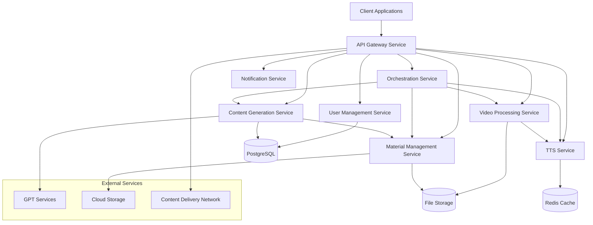
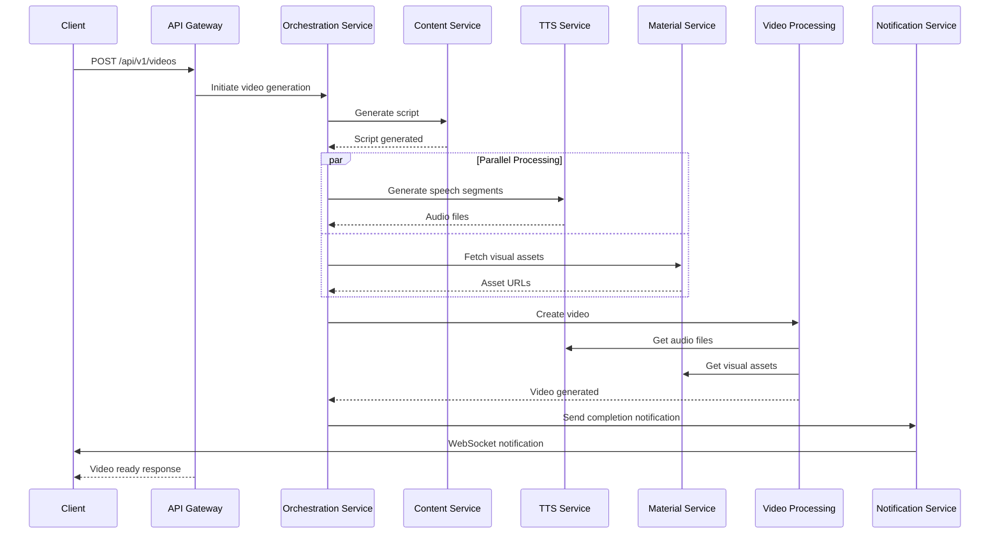
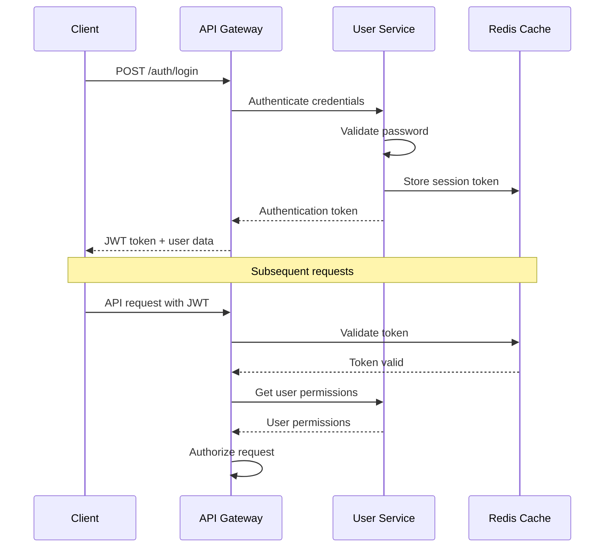

# MoneyPrinterTurbo Microservices Architecture Design

## 1. System Overview

Based on analysis of the current monolithic architecture, this document presents a comprehensive microservices design for MoneyPrinterTurbo, transitioning from a single FastAPI application to 8 specialized services with clear domain boundaries.

### Current Architecture Analysis
- **Monolithic FastAPI** with layered architecture
- **Core Components**: Video processing, TTS, MCP server, state management
- **Infrastructure**: Redis/Memory state, GPU acceleration, security middleware
- **Challenges**: Tight coupling, single points of failure, scaling limitations

### Proposed Microservices Architecture



## 2. Service Definitions

### 2.1 API Gateway Service
**Domain**: Entry point and routing
**Port**: 8000
**Technology**: FastAPI + Traefik/Kong

#### Responsibilities
- Request routing and load balancing
- Authentication and authorization
- Rate limiting and throttling
- API versioning management
- Response aggregation
- Security enforcement (CORS, HTTPS)

#### API Specification
```yaml
openapi: 3.0.3
info:
  title: MoneyPrinter API Gateway
  version: 1.0.0
paths:
  /api/v1/videos:
    post:
      summary: Create video generation request
      requestBody:
        required: true
        content:
          application/json:
            schema:
              $ref: '#/components/schemas/VideoRequest'
      responses:
        '201':
          description: Video generation initiated
          content:
            application/json:
              schema:
                $ref: '#/components/schemas/VideoResponse'
  /api/v1/videos/{video_id}/status:
    get:
      summary: Get video processing status
      parameters:
        - name: video_id
          in: path
          required: true
          schema:
            type: string
      responses:
        '200':
          description: Video status
          content:
            application/json:
              schema:
                $ref: '#/components/schemas/VideoStatus'

components:
  schemas:
    VideoRequest:
      type: object
      properties:
        title:
          type: string
        script:
          type: string
        voice_settings:
          $ref: '#/components/schemas/VoiceSettings'
        video_settings:
          $ref: '#/components/schemas/VideoSettings'
    VideoResponse:
      type: object
      properties:
        video_id:
          type: string
        status:
          type: string
        estimated_completion:
          type: string
          format: date-time
    VideoStatus:
      type: object
      properties:
        video_id:
          type: string
        status:
          type: string
          enum: [pending, processing, completed, failed]
        progress:
          type: integer
          minimum: 0
          maximum: 100
        stages:
          type: array
          items:
            $ref: '#/components/schemas/ProcessingStage'
```

### 2.2 User Management Service
**Domain**: User accounts and authentication
**Port**: 8001
**Technology**: FastAPI + SQLAlchemy + PostgreSQL

#### Responsibilities
- User registration and authentication
- Profile management
- API key management
- Usage tracking and quotas
- Subscription management
- Role-based access control (RBAC)

#### Data Model
```python
from sqlalchemy import Column, String, DateTime, Integer, Boolean, JSON
from sqlalchemy.ext.declarative import declarative_base

Base = declarative_base()

class User(Base):
    __tablename__ = "users"
    
    id = Column(String, primary_key=True)
    email = Column(String, unique=True, nullable=False)
    password_hash = Column(String, nullable=False)
    full_name = Column(String)
    is_active = Column(Boolean, default=True)
    is_verified = Column(Boolean, default=False)
    created_at = Column(DateTime)
    updated_at = Column(DateTime)
    
    # Subscription and usage
    subscription_tier = Column(String, default="free")
    monthly_quota = Column(Integer, default=10)
    current_usage = Column(Integer, default=0)
    reset_date = Column(DateTime)
    
    # Settings
    preferences = Column(JSON, default=dict)
    api_keys = Column(JSON, default=list)

class UserSession(Base):
    __tablename__ = "user_sessions"
    
    id = Column(String, primary_key=True)
    user_id = Column(String, nullable=False)
    token_hash = Column(String, nullable=False)
    expires_at = Column(DateTime, nullable=False)
    created_at = Column(DateTime)
    last_used = Column(DateTime)
    ip_address = Column(String)
    user_agent = Column(String)
```

#### API Specification
```yaml
paths:
  /auth/register:
    post:
      summary: Register new user
      requestBody:
        required: true
        content:
          application/json:
            schema:
              type: object
              properties:
                email:
                  type: string
                  format: email
                password:
                  type: string
                  minLength: 8
                full_name:
                  type: string
      responses:
        '201':
          description: User created
  /auth/login:
    post:
      summary: Authenticate user
      requestBody:
        required: true
        content:
          application/json:
            schema:
              type: object
              properties:
                email:
                  type: string
                password:
                  type: string
      responses:
        '200':
          description: Authentication successful
          content:
            application/json:
              schema:
                type: object
                properties:
                  access_token:
                    type: string
                  refresh_token:
                    type: string
                  user:
                    $ref: '#/components/schemas/UserProfile'
```

### 2.3 Content Generation Service
**Domain**: Script and content creation
**Port**: 8002
**Technology**: FastAPI + LangChain + OpenAI/Anthropic APIs

#### Responsibilities
- Script generation from topics/prompts
- Content enhancement and optimization
- Multi-language content support
- SEO optimization
- Content templates and variations
- Integration with LLM providers

#### Service Architecture
```python
from abc import ABC, abstractmethod
from typing import List, Dict, Any, Optional
from pydantic import BaseModel

class ContentRequest(BaseModel):
    topic: str
    style: str = "engaging"
    duration_target: int = 60  # seconds
    language: str = "en"
    keywords: Optional[List[str]] = None
    tone: str = "professional"
    include_hook: bool = True
    target_audience: str = "general"

class GeneratedContent(BaseModel):
    script: str
    title: str
    description: str
    keywords: List[str]
    estimated_duration: int
    sections: List[Dict[str, Any]]
    metadata: Dict[str, Any]

class LLMProvider(ABC):
    @abstractmethod
    async def generate_content(self, request: ContentRequest) -> GeneratedContent:
        pass

class OpenAIProvider(LLMProvider):
    def __init__(self, api_key: str, model: str = "gpt-4"):
        self.api_key = api_key
        self.model = model
    
    async def generate_content(self, request: ContentRequest) -> GeneratedContent:
        # Implementation with OpenAI API
        pass

class ContentGenerationService:
    def __init__(self):
        self.providers = {
            "openai": OpenAIProvider(),
            "anthropic": AnthropicProvider(),
            "local": LocalLLMProvider()
        }
        self.template_engine = ContentTemplateEngine()
        self.optimizer = SEOOptimizer()
    
    async def generate_script(self, request: ContentRequest, provider: str = "openai") -> GeneratedContent:
        provider_instance = self.providers[provider]
        content = await provider_instance.generate_content(request)
        
        # Post-processing
        content = await self.optimizer.optimize_for_seo(content)
        content = await self.template_engine.apply_styling(content, request.style)
        
        return content
```

### 2.4 TTS (Text-to-Speech) Service
**Domain**: Voice synthesis
**Port**: 8003
**Technology**: FastAPI + Multiple TTS providers

#### Responsibilities
- Text-to-speech conversion
- Voice selection and customization
- Audio quality optimization
- Multi-language support
- Voice cloning capabilities
- Audio post-processing

#### Service Architecture
```python
from abc import ABC, abstractmethod
from typing import Dict, Any, Optional, Union
import asyncio
from pathlib import Path

class TTSProvider(ABC):
    @abstractmethod
    async def synthesize(self, text: str, voice_config: Dict[str, Any]) -> bytes:
        pass
    
    @abstractmethod
    def get_available_voices(self) -> List[Dict[str, Any]]:
        pass

class EdgeTTSProvider(TTSProvider):
    async def synthesize(self, text: str, voice_config: Dict[str, Any]) -> bytes:
        # Edge TTS implementation
        pass

class ElevenLabsProvider(TTSProvider):
    async def synthesize(self, text: str, voice_config: Dict[str, Any]) -> bytes:
        # ElevenLabs implementation
        pass

class GoogleTTSProvider(TTSProvider):
    async def synthesize(self, text: str, voice_config: Dict[str, Any]) -> bytes:
        # Google TTS implementation
        pass

class TTSService:
    def __init__(self):
        self.providers = {
            "edge": EdgeTTSProvider(),
            "elevenlabs": ElevenLabsProvider(),
            "google": GoogleTTSProvider(),
            "characterbox": CharacterBoxProvider()
        }
        self.audio_processor = AudioProcessor()
        self.cache = TTSCache()
    
    async def synthesize_speech(
        self, 
        text: str, 
        voice_config: Dict[str, Any],
        provider: str = "edge"
    ) -> bytes:
        # Check cache first
        cache_key = self._generate_cache_key(text, voice_config, provider)
        cached_audio = await self.cache.get(cache_key)
        if cached_audio:
            return cached_audio
        
        # Generate speech
        provider_instance = self.providers[provider]
        audio_data = await provider_instance.synthesize(text, voice_config)
        
        # Post-process audio
        processed_audio = await self.audio_processor.enhance_quality(audio_data)
        
        # Cache result
        await self.cache.set(cache_key, processed_audio, ttl=3600)
        
        return processed_audio
```

### 2.5 Video Processing Service
**Domain**: Video creation and editing
**Port**: 8004
**Technology**: FastAPI + FFmpeg + OpenCV + GPU acceleration

#### Responsibilities
- Video generation from scripts and audio
- Visual effects and transitions
- Subtitle generation and embedding
- Video quality optimization
- Format conversion and encoding
- Thumbnail generation

#### Service Architecture
```python
from typing import List, Dict, Any, Optional
import asyncio
from pathlib import Path
import cv2
import numpy as np

class VideoProcessor:
    def __init__(self):
        self.gpu_manager = GPUManager()
        self.codec_optimizer = CodecOptimizer()
        self.effects_engine = EffectsEngine()
        self.subtitle_renderer = SubtitleRenderer()
    
    async def create_video(
        self,
        script_segments: List[Dict[str, Any]],
        audio_file: Path,
        visual_assets: List[Path],
        config: Dict[str, Any]
    ) -> Path:
        """Create video from components"""
        
        # Initialize video pipeline
        pipeline = VideoPipeline(
            resolution=config.get("resolution", "1920x1080"),
            fps=config.get("fps", 30),
            codec=config.get("codec", "h264"),
            quality=config.get("quality", "high")
        )
        
        # Process visual assets
        processed_visuals = []
        for asset in visual_assets:
            processed = await self._process_visual_asset(asset, config)
            processed_visuals.append(processed)
        
        # Generate subtitles if required
        subtitles = None
        if config.get("include_subtitles", True):
            subtitles = await self.subtitle_renderer.generate_subtitles(
                script_segments, audio_file
            )
        
        # Combine all elements
        video_path = await pipeline.render_video(
            visuals=processed_visuals,
            audio=audio_file,
            subtitles=subtitles,
            effects=config.get("effects", [])
        )
        
        # Post-process and optimize
        optimized_path = await self.codec_optimizer.optimize_video(
            video_path, config.get("optimization_preset", "web")
        )
        
        return optimized_path
    
    async def _process_visual_asset(self, asset_path: Path, config: Dict[str, Any]) -> Path:
        """Process individual visual asset"""
        # Apply effects, resize, optimize
        pass

class VideoPipeline:
    def __init__(self, resolution: str, fps: int, codec: str, quality: str):
        self.resolution = resolution
        self.fps = fps
        self.codec = codec
        self.quality = quality
        self.temp_dir = Path("/tmp/video_processing")
    
    async def render_video(
        self,
        visuals: List[Path],
        audio: Path,
        subtitles: Optional[Path] = None,
        effects: List[Dict[str, Any]] = None
    ) -> Path:
        """Render final video"""
        # FFmpeg pipeline implementation
        pass
```

### 2.6 Material Management Service
**Domain**: Asset and resource management
**Port**: 8005
**Technology**: FastAPI + MinIO/S3 + PostgreSQL

#### Responsibilities
- Stock image/video management
- User asset uploads
- Asset categorization and tagging
- Search and recommendation
- CDN integration
- Asset optimization and variants

#### Data Model
```python
class Asset(Base):
    __tablename__ = "assets"
    
    id = Column(String, primary_key=True)
    user_id = Column(String, nullable=True)  # None for stock assets
    filename = Column(String, nullable=False)
    original_filename = Column(String)
    file_type = Column(String, nullable=False)  # image, video, audio
    mime_type = Column(String, nullable=False)
    file_size = Column(Integer, nullable=False)
    
    # Asset metadata
    width = Column(Integer)
    height = Column(Integer)
    duration = Column(Float)  # For video/audio
    
    # Organization
    category = Column(String)
    tags = Column(JSON, default=list)
    description = Column(String)
    
    # Storage
    storage_provider = Column(String, default="s3")  # s3, minio, local
    storage_path = Column(String, nullable=False)
    cdn_url = Column(String)
    
    # Status
    processing_status = Column(String, default="pending")  # pending, processing, ready, failed
    is_public = Column(Boolean, default=False)
    is_deleted = Column(Boolean, default=False)
    
    created_at = Column(DateTime)
    updated_at = Column(DateTime)

class AssetVariant(Base):
    __tablename__ = "asset_variants"
    
    id = Column(String, primary_key=True)
    asset_id = Column(String, nullable=False)
    variant_type = Column(String, nullable=False)  # thumbnail, preview, optimized
    width = Column(Integer)
    height = Column(Integer)
    file_size = Column(Integer)
    storage_path = Column(String, nullable=False)
    cdn_url = Column(String)
    created_at = Column(DateTime)
```

### 2.7 Orchestration Service
**Domain**: Workflow coordination
**Port**: 8006
**Technology**: FastAPI + Celery + Redis

#### Responsibilities
- Video generation workflow orchestration
- Service coordination and communication
- Task queue management
- Progress tracking and notifications
- Error handling and retry logic
- Workflow state management

#### Workflow Definition
```python
from celery import Celery, group, chain, chord
from typing import Dict, Any, List

class VideoGenerationWorkflow:
    def __init__(self):
        self.celery_app = Celery('orchestration')
        self.state_manager = WorkflowStateManager()
    
    async def execute_video_generation(
        self,
        request_id: str,
        user_id: str,
        video_config: Dict[str, Any]
    ) -> str:
        """Execute complete video generation workflow"""
        
        # Update initial state
        await self.state_manager.update_workflow_state(
            request_id, "started", {"stage": "initialization"}
        )
        
        # Define workflow steps
        workflow = chain(
            # Step 1: Generate content
            generate_content_task.s(
                request_id, video_config["topic"], video_config["style"]
            ),
            
            # Step 2: Generate speech (parallel for different segments)
            group([
                generate_speech_task.s(request_id, segment_data)
                for segment_data in video_config.get("segments", [])
            ]),
            
            # Step 3: Prepare visual assets
            prepare_assets_task.s(request_id, video_config["visual_style"]),
            
            # Step 4: Generate video
            generate_video_task.s(request_id),
            
            # Step 5: Post-processing and optimization
            chord([
                optimize_video_task.s(request_id),
                generate_thumbnail_task.s(request_id),
                generate_preview_task.s(request_id)
            ], finalize_video_task.s(request_id))
        )
        
        # Execute workflow
        result = workflow.apply_async()
        
        # Store workflow reference
        await self.state_manager.store_workflow_reference(request_id, result.id)
        
        return result.id

@celery_app.task(bind=True)
def generate_content_task(self, request_id: str, topic: str, style: str):
    """Task for content generation"""
    try:
        # Call Content Generation Service
        content_service = ContentGenerationClient()
        result = content_service.generate_script({
            "topic": topic,
            "style": style
        })
        
        # Update state
        state_manager.update_task_state(request_id, "content_generated", result)
        return result
        
    except Exception as e:
        # Handle error and retry logic
        self.retry(countdown=60, max_retries=3)

@celery_app.task(bind=True)
def generate_speech_task(self, request_id: str, segment_data: Dict[str, Any]):
    """Task for speech synthesis"""
    try:
        tts_service = TTSServiceClient()
        audio_data = tts_service.synthesize_speech(
            segment_data["text"],
            segment_data["voice_config"]
        )
        
        state_manager.update_task_state(
            request_id, f"speech_generated_{segment_data['id']}", audio_data
        )
        return audio_data
        
    except Exception as e:
        self.retry(countdown=30, max_retries=2)
```

### 2.8 Notification Service
**Domain**: User notifications and communications
**Port**: 8007
**Technology**: FastAPI + WebSocket + Email providers

#### Responsibilities
- Real-time progress notifications
- Email notifications
- WebSocket connections management
- Notification templates
- Delivery tracking
- Multi-channel support

#### Service Architecture
```python
from typing import Dict, Any, List, Optional
import asyncio
from fastapi import WebSocket
from email.mime.text import MIMEText
from email.mime.multipart import MIMEMultipart

class NotificationService:
    def __init__(self):
        self.websocket_manager = WebSocketManager()
        self.email_provider = EmailProvider()
        self.template_engine = NotificationTemplateEngine()
        self.delivery_tracker = DeliveryTracker()
    
    async def send_notification(
        self,
        user_id: str,
        notification_type: str,
        data: Dict[str, Any],
        channels: List[str] = ["websocket"]
    ):
        """Send notification through specified channels"""
        
        notification = await self.template_engine.render_notification(
            notification_type, data
        )
        
        delivery_results = {}
        
        for channel in channels:
            try:
                if channel == "websocket":
                    await self._send_websocket_notification(user_id, notification)
                elif channel == "email":
                    await self._send_email_notification(user_id, notification)
                elif channel == "push":
                    await self._send_push_notification(user_id, notification)
                
                delivery_results[channel] = "success"
                
            except Exception as e:
                delivery_results[channel] = f"failed: {str(e)}"
        
        # Track delivery
        await self.delivery_tracker.record_delivery(
            user_id, notification_type, delivery_results
        )
        
        return delivery_results
    
    async def _send_websocket_notification(self, user_id: str, notification: Dict[str, Any]):
        """Send real-time notification via WebSocket"""
        await self.websocket_manager.send_to_user(user_id, notification)
    
    async def _send_email_notification(self, user_id: str, notification: Dict[str, Any]):
        """Send email notification"""
        user_service = UserServiceClient()
        user_data = await user_service.get_user(user_id)
        
        await self.email_provider.send_email(
            to=user_data["email"],
            subject=notification["subject"],
            html_content=notification["html_content"],
            text_content=notification["text_content"]
        )

class WebSocketManager:
    def __init__(self):
        self.active_connections: Dict[str, List[WebSocket]] = {}
    
    async def connect(self, websocket: WebSocket, user_id: str):
        """Connect user WebSocket"""
        await websocket.accept()
        if user_id not in self.active_connections:
            self.active_connections[user_id] = []
        self.active_connections[user_id].append(websocket)
    
    async def disconnect(self, websocket: WebSocket, user_id: str):
        """Disconnect user WebSocket"""
        if user_id in self.active_connections:
            self.active_connections[user_id].remove(websocket)
            if not self.active_connections[user_id]:
                del self.active_connections[user_id]
    
    async def send_to_user(self, user_id: str, message: Dict[str, Any]):
        """Send message to all user connections"""
        if user_id in self.active_connections:
            disconnected = []
            for websocket in self.active_connections[user_id]:
                try:
                    await websocket.send_json(message)
                except:
                    disconnected.append(websocket)
            
            # Clean up disconnected sockets
            for websocket in disconnected:
                await self.disconnect(websocket, user_id)
```

## 3. Data Flow Diagrams

### 3.1 Video Generation Flow



### 3.2 Authentication Flow



## 4. Technology Stack Blueprint

### 4.1 Core Technologies per Service

| Service | Framework | Database | Cache | Queue | Storage |
|---------|-----------|----------|-------|-------|---------|
| API Gateway | FastAPI + Traefik | - | Redis | - | - |
| User Management | FastAPI | PostgreSQL | Redis | - | - |
| Content Generation | FastAPI | PostgreSQL | Redis | Celery | - |
| TTS Service | FastAPI | - | Redis | Celery | S3/MinIO |
| Video Processing | FastAPI | - | Redis | Celery | S3/MinIO |
| Material Management | FastAPI | PostgreSQL | Redis | - | S3/MinIO |
| Orchestration | FastAPI | PostgreSQL | Redis | Celery | - |
| Notification | FastAPI | PostgreSQL | Redis | - | - |

### 4.2 Infrastructure Components

```yaml
# docker-compose.yml structure
version: '3.8'
services:
  # Databases
  postgres:
    image: postgres:15
    environment:
      POSTGRES_MULTIPLE_DATABASES: users,content,materials,orchestration,notifications
  
  redis:
    image: redis:7-alpine
    command: redis-server --appendonly yes
  
  # Message Queue
  rabbitmq:
    image: rabbitmq:3-management
  
  # Storage
  minio:
    image: minio/minio
    command: server /data --console-address ":9001"
  
  # Load Balancer
  traefik:
    image: traefik:v3.0
    ports:
      - "80:80"
      - "443:443"
      - "8080:8080"
  
  # Services
  api-gateway:
    build: ./services/gateway
    ports:
      - "8000:8000"
    depends_on:
      - redis
      - traefik
  
  user-service:
    build: ./services/user
    ports:
      - "8001:8001"
    depends_on:
      - postgres
      - redis
  
  # ... other services
```

### 4.3 Service Communication Patterns

#### Synchronous Communication (HTTP/REST)
- **API Gateway → All Services**: Request routing
- **Orchestration → Services**: Direct service calls
- **Services → External APIs**: Third-party integrations

#### Asynchronous Communication (Message Queues)
- **Orchestration Service**: Workflow coordination via Celery
- **Event Publishing**: Service state changes
- **Notification Delivery**: Real-time updates

#### Caching Strategy
- **Redis Clusters**: Distributed caching
- **Service-level Caching**: Local memory caches
- **CDN Integration**: Static asset delivery

## 5. Deployment Architecture

### 5.1 Container Orchestration

```yaml
# Kubernetes deployment example
apiVersion: apps/v1
kind: Deployment
metadata:
  name: video-processing-service
spec:
  replicas: 3
  selector:
    matchLabels:
      app: video-processing
  template:
    metadata:
      labels:
        app: video-processing
    spec:
      containers:
      - name: video-processing
        image: moneyprinter/video-processing:latest
        ports:
        - containerPort: 8004
        env:
        - name: REDIS_URL
          value: "redis://redis-service:6379"
        - name: DATABASE_URL
          valueFrom:
            secretKeyRef:
              name: db-secret
              key: url
        resources:
          requests:
            memory: "2Gi"
            cpu: "1000m"
            nvidia.com/gpu: 1
          limits:
            memory: "4Gi"
            cpu: "2000m"
            nvidia.com/gpu: 1
        volumeMounts:
        - name: video-storage
          mountPath: /tmp/video_processing
      volumes:
      - name: video-storage
        persistentVolumeClaim:
          claimName: video-pvc
```

### 5.2 Scaling Strategy

#### Horizontal Scaling
- **Stateless Services**: API Gateway, Content Generation, TTS
- **Load Balancing**: Round-robin with health checks
- **Auto-scaling**: Based on CPU/memory metrics

#### Vertical Scaling
- **GPU-intensive Services**: Video Processing
- **Memory-intensive Services**: Material Management

#### Storage Scaling
- **Object Storage**: S3/MinIO for assets
- **Database Sharding**: User data partitioning
- **CDN Integration**: Global content delivery

### 5.3 Monitoring and Observability

```yaml
# Monitoring stack
monitoring:
  prometheus:
    - Service metrics collection
    - Custom business metrics
    - Alert rules configuration
  
  grafana:
    - Service dashboards
    - Performance visualizations
    - Alert notifications
  
  jaeger:
    - Distributed tracing
    - Request flow analysis
    - Performance bottlenecks
  
  elk_stack:
    - Centralized logging
    - Log aggregation
    - Search and analysis
```

## 6. Migration Strategy

### Phase 1: Infrastructure Setup (Week 1-2)
1. Set up container registry and CI/CD pipelines
2. Deploy shared infrastructure (databases, message queues)
3. Implement API Gateway with basic routing

### Phase 2: Core Services (Week 3-6)
1. **User Management Service**: Extract authentication logic
2. **Material Management Service**: Move asset handling
3. **Content Generation Service**: Isolate script generation

### Phase 3: Processing Services (Week 7-10)
1. **TTS Service**: Extract voice synthesis
2. **Video Processing Service**: Move video generation
3. **Notification Service**: Implement real-time updates

### Phase 4: Orchestration (Week 11-12)
1. **Orchestration Service**: Implement workflow management
2. **Service Integration**: Connect all services
3. **Testing and Optimization**: End-to-end validation

### Phase 5: Production Deployment (Week 13-14)
1. **Gradual Rollout**: Feature flags and A/B testing
2. **Performance Monitoring**: Metrics and alerting
3. **Documentation**: API documentation and runbooks

## 7. Security Considerations

### Authentication & Authorization
- **JWT Tokens**: Service-to-service authentication
- **OAuth 2.0**: Third-party integrations
- **API Keys**: External service access
- **RBAC**: Role-based permissions

### Data Protection
- **Encryption at Rest**: Database and storage encryption
- **Encryption in Transit**: TLS/SSL for all communications
- **PII Handling**: Data anonymization and retention policies
- **Compliance**: GDPR and CCPA requirements

### Network Security
- **Service Mesh**: Istio for inter-service communication
- **Network Policies**: Kubernetes network segmentation
- **Rate Limiting**: DDoS protection and abuse prevention
- **Input Validation**: Request sanitization and validation

## 8. Performance Optimization

### Caching Strategy
- **Multi-layer Caching**: Application, database, and CDN levels
- **Cache Invalidation**: Event-driven cache updates
- **Content Delivery**: Global CDN for static assets

### Database Optimization
- **Connection Pooling**: Efficient database connections
- **Query Optimization**: Indexed queries and caching
- **Read Replicas**: Distributed read operations

### GPU Utilization
- **Resource Scheduling**: Optimal GPU allocation
- **Batch Processing**: Efficient GPU utilization
- **Memory Management**: GPU memory optimization

This comprehensive architecture design provides a solid foundation for transitioning MoneyPrinterTurbo from a monolithic to a microservices architecture, ensuring scalability, maintainability, and performance.