# MoneyPrinterTurbo System Architecture Overview

## Executive Summary

This document presents the comprehensive system architecture for the refactored MoneyPrinterTurbo platform, transforming the monolithic 1960-line `video.py` file into a scalable, secure, and modular microservices architecture. The design emphasizes SPARC principles: secure, modular, testable, and maintainable.

## Current State vs Target Architecture

### Current State Issues
- **Monolithic Structure**: Single 1960-line file handling all video processing
- **Security Vulnerabilities**: Hard-coded secrets and configuration debt
- **Technical Debt**: Circular dependencies, memory leaks, service failures
- **Scalability Limitations**: Single-threaded processing, resource contention

### Target Architecture Principles
- **Microservices Design**: Domain-driven service boundaries (≤500 lines per module)
- **Zero-Trust Security**: End-to-end authentication, authorization, and encryption
- **Event-Driven Processing**: Asynchronous messaging and parallel execution
- **Auto-Scaling Infrastructure**: Container-based deployment with intelligent scaling

## High-Level System Architecture

```mermaid
graph TB
    %% External Systems
    Users[👥 Users] --> LB[Load Balancer]
    CDN[🌐 CDN] --> LB
    
    %% API Gateway Layer
    LB --> Gateway[🛡️ API Gateway<br/>Rate Limiting, Auth, Validation]
    
    %% Core Microservices
    Gateway --> VideoOrchestrator[🎬 Video Orchestrator<br/>Workflow Coordination]
    Gateway --> AudioService[🎵 Audio Service<br/>TTS & Mixing]
    Gateway --> ContentService[📝 Content Service<br/>Scripts & Subtitles]
    Gateway --> UserService[👤 User Service<br/>Auth & Profiles]
    
    %% Processing Services
    VideoOrchestrator --> ValidationService[✅ Validation Service<br/>Input & File Validation]
    VideoOrchestrator --> ProcessingService[⚙️ Processing Service<br/>Video Transformation]
    VideoOrchestrator --> ConcatenationService[🔗 Concatenation Service<br/>Video Assembly]
    VideoOrchestrator --> RenderingService[🎨 Rendering Service<br/>Effects & Optimization]
    
    %% Infrastructure Services
    Gateway --> ConfigService[⚙️ Config Service<br/>Secure Configuration]
    VideoOrchestrator --> MonitoringService[📊 Monitoring Service<br/>Metrics & Alerting]
    ProcessingService --> StorageService[💾 Storage Service<br/>File Management]
    
    %% Data Layer
    ConfigService --> Vault[🔐 HashiCorp Vault<br/>Secret Management]
    UserService --> Database[(🗄️ PostgreSQL<br/>User & Project Data)]
    MonitoringService --> Cache[(⚡ Redis<br/>Cache & Sessions)]
    StorageService --> FileStorage[(📁 Object Storage<br/>Videos & Assets)]
    
    %% Message Queue
    VideoOrchestrator --> MessageQueue[📨 Message Queue<br/>Async Processing]
    ProcessingService --> MessageQueue
    ConcatenationService --> MessageQueue
    RenderingService --> MessageQueue
    
    %% External Integrations
    AudioService --> OpenAI[🤖 OpenAI TTS]
    AudioService --> Google[🌍 Google TTS]
    AudioService --> Azure[☁️ Azure TTS]
    ContentService --> CharacterAI[🎭 Character.ai]

    classDef serviceNode fill:#e1f5fe,stroke:#0277bd,stroke-width:2px
    classDef securityNode fill:#fff3e0,stroke:#f57c00,stroke-width:2px
    classDef dataNode fill:#f3e5f5,stroke:#7b1fa2,stroke-width:2px
    classDef externalNode fill:#e8f5e8,stroke:#388e3c,stroke-width:2px
    
    class Gateway,ConfigService securityNode
    class Database,Cache,FileStorage,Vault dataNode
    class OpenAI,Google,Azure,CharacterAI externalNode
    class VideoOrchestrator,AudioService,ContentService,ValidationService,ProcessingService serviceNode
```



## Service Boundaries and Responsibilities

### 1. API Gateway Service
**Responsibility**: Entry point security, routing, and cross-cutting concerns
- **Port**: 8080 (HTTP/HTTPS)
- **Technologies**: Kong/Envoy Proxy, JWT validation
- **Scaling**: Horizontal (2-10 instances)

**Core Functions**:
- Rate limiting (100 req/min per user, 1000 req/min burst)
- JWT token validation and refresh
- Request/response logging and metrics
- SSL termination and security headers
- Service discovery and load balancing


### 2. Video Processing Orchestrator
**Responsibility**: Workflow coordination and state management
- **Port**: 8081
- **Technologies**: Python FastAPI, Celery, Redis
- **Scaling**: Horizontal (3-8 instances)

**Core Functions**:
- Video processing workflow orchestration
- Task queue management and distribution
- Progress tracking and status updates
- Error handling and retry logic
- Resource allocation and optimization

### 3. Audio Processing Service
**Responsibility**: Text-to-speech and audio mixing
- **Port**: 8082
- **Technologies**: Python, FFmpeg, Provider SDKs
- **Scaling**: Horizontal (2-6 instances)

**Core Functions**:
- Multi-provider TTS with fallback (OpenAI → Google → Azure)
- Audio mixing and background music integration
- Voice synthesis and quality optimization
- Audio format conversion and normalization

### 4. Content Management Service
**Responsibility**: Script generation and subtitle management
- **Port**: 8083
- **Technologies**: Python FastAPI, AI integrations
- **Scaling**: Horizontal (2-4 instances)

**Core Functions**:
- Script generation and content validation
- Subtitle timing and formatting
- Content moderation and filtering
- Multi-language support

### 5. Video Processing Service
**Responsibility**: Core video transformation and optimization
- **Port**: 8084
- **Technologies**: Python, FFmpeg, CUDA/OpenCL
- **Scaling**: Vertical + Horizontal (GPU-optimized)

**Core Functions**:
- Video format conversion and codec optimization
- Resolution scaling and aspect ratio handling
- Hardware-accelerated processing (NVENC, QSV)
- Parallel clip processing with memory management

### 6. Security and Configuration Service
**Responsibility**: Secure configuration and secret management
- **Port**: 8085 (Internal only)
- **Technologies**: HashiCorp Vault, Python
- **Scaling**: High availability (3 instances)

**Core Functions**:
- Secret storage and rotation
- Environment-specific configuration
- Credential management and encryption
- Security audit logging

## Data Flow Architecture

### Video Processing Pipeline


### Security Architecture (Zero-Trust Model)

```mermaid
graph TB
    %% External Layer
    Internet[🌐 Internet] --> WAF[🛡️ Web Application Firewall]
    WAF --> LB[⚖️ Load Balancer + DDoS Protection]
    
    %% Security Perimeter
    LB --> Gateway[🚪 API Gateway<br/>- JWT Validation<br/>- Rate Limiting<br/>- Request Sanitization]
    
    %% Service Mesh Security
    Gateway --> ServiceMesh[🕸️ Service Mesh<br/>- mTLS Communication<br/>- Service-to-Service Auth<br/>- Traffic Encryption]
    
    %% Microservices with RBAC
    ServiceMesh --> VideoSvc[🎬 Video Service<br/>Role: video.process]
    ServiceMesh --> AudioSvc[🎵 Audio Service<br/>Role: audio.generate]
    ServiceMesh --> ContentSvc[📝 Content Service<br/>Role: content.manage]
    ServiceMesh --> UserSvc[👤 User Service<br/>Role: user.admin]
    
    %% Secure Configuration
    VideoSvc --> Vault[🔐 HashiCorp Vault<br/>- Secret Rotation<br/>- Encryption at Rest<br/>- Audit Logging]
    AudioSvc --> Vault
    ContentSvc --> Vault
    UserSvc --> Vault
    
    %% Data Security
    VideoSvc --> SecureDB[(🔒 Encrypted Database<br/>- Column Encryption<br/>- Access Logging<br/>- Backup Encryption)]
    UserSvc --> SecureDB
    
    VideoSvc --> SecureStorage[(🗄️ Encrypted Storage<br/>- Client-side Encryption<br/>- Access Controls<br/>- Audit Trail)]
    
    %% Monitoring and Alerting
    ServiceMesh --> SIEM[📊 SIEM System<br/>- Real-time Monitoring<br/>- Threat Detection<br/>- Incident Response]
    Vault --> SIEM
    SecureDB --> SIEM
    SecureStorage --> SIEM
    
    %% Network Security
    subgraph VPC [🏢 Virtual Private Cloud]
        subgraph PublicSubnet [📡 Public Subnet]
            LB
            Gateway
        end
        
        subgraph PrivateSubnet [🔒 Private Subnet]
            ServiceMesh
            VideoSvc
            AudioSvc
            ContentSvc
            UserSvc
        end
        
        subgraph DataSubnet [🗄️ Data Subnet]
            Vault
            SecureDB
            SecureStorage
        end
    end
    
    classDef securityNode fill:#fff3e0,stroke:#f57c00,stroke-width:3px
    classDef serviceNode fill:#e1f5fe,stroke:#0277bd,stroke-width:2px
    classDef dataNode fill:#f3e5f5,stroke:#7b1fa2,stroke-width:2px
    classDef networkNode fill:#e8f5e8,stroke:#388e3c,stroke-width:2px
    
    class WAF,Gateway,ServiceMesh,Vault,SIEM securityNode
    class VideoSvc,AudioSvc,ContentSvc,UserSvc serviceNode
    class SecureDB,SecureStorage dataNode
    class VPC,PublicSubnet,PrivateSubnet,DataSubnet networkNode
```



## Performance Architecture

### Auto-Scaling Strategy

```mermaid
graph LR
    %% Monitoring Layer
    Metrics[📊 Metrics Collection<br/>- CPU/Memory Usage<br/>- Request Latency<br/>- Queue Depth<br/>- Error Rates] --> HPA[🔄 Horizontal Pod Autoscaler]
    
    %% Scaling Decision Engine
    HPA --> ScalingEngine{Scaling Decision Engine}
    
    %% Scale Up Conditions
    ScalingEngine -->|CPU > 70%<br/>Queue > 100<br/>Latency > 2s| ScaleUp[📈 Scale Up<br/>+1 to +5 instances]
    
    %% Scale Down Conditions
    ScalingEngine -->|CPU < 30%<br/>Queue < 10<br/>Latency < 500ms| ScaleDown[📉 Scale Down<br/>-1 instance]
    
    %% Service-Specific Scaling
    ScaleUp --> VideoProcessing[🎬 Video Processing<br/>GPU-Optimized Instances<br/>2-8 replicas]
    ScaleUp --> AudioProcessing[🎵 Audio Processing<br/>CPU-Optimized Instances<br/>2-6 replicas]
    ScaleUp --> APIGateway[🚪 API Gateway<br/>Network-Optimized<br/>2-10 replicas]
    
    ScaleDown --> VideoProcessing
    ScaleDown --> AudioProcessing
    ScaleDown --> APIGateway
    
    %% Resource Optimization
    VideoProcessing --> GPUScheduler[🎯 GPU Scheduler<br/>- Node Affinity<br/>- Resource Limits<br/>- Queue Priority]
    AudioProcessing --> CPUScheduler[⚡ CPU Scheduler<br/>- Thread Pool<br/>- Memory Limits<br/>- Load Balancing]
    
    classDef metricNode fill:#fff3e0,stroke:#f57c00,stroke-width:2px
    classDef scalingNode fill:#e3f2fd,stroke:#1976d2,stroke-width:2px
    classDef serviceNode fill:#e8f5e8,stroke:#388e3c,stroke-width:2px
    classDef optimizationNode fill:#f3e5f5,stroke:#7b1fa2,stroke-width:2px
    
    class Metrics metricNode
    class HPA,ScalingEngine,ScaleUp,ScaleDown scalingNode
    class VideoProcessing,AudioProcessing,APIGateway serviceNode
    class GPUScheduler,CPUScheduler optimizationNode
```



### Memory Management and Resource Optimization

**Resource Allocation Strategy**:
- **Video Processing**: 4-8 GB RAM, 1-2 GPU cores per instance
- **Audio Processing**: 2-4 GB RAM, 2-4 CPU cores per instance
- **API Gateway**: 1-2 GB RAM, 1-2 CPU cores per instance
- **Database**: 8-16 GB RAM, dedicated SSD storage

**Memory Optimization Techniques**:
- Streaming video processing to minimize memory footprint
- Intelligent garbage collection and resource cleanup
- Memory pooling for frequently allocated objects
- Circuit breakers to prevent memory exhaustion

## Deployment Architecture

### Container Orchestration

```mermaid
graph TB
    %% Load Balancer
    LB[🌐 Cloud Load Balancer<br/>SSL Termination<br/>DDoS Protection] --> Ingress[🚪 Ingress Controller<br/>NGINX/Traefik]
    
    %% Kubernetes Cluster
    subgraph K8s [☸️ Kubernetes Cluster]
        %% Control Plane
        subgraph ControlPlane [🎛️ Control Plane]
            API[API Server]
            ETCD[etcd]
            Scheduler[Scheduler]
        end
        
        %% Worker Nodes
        subgraph WorkerNodes [👷 Worker Nodes]
            %% API Gateway Pods
            subgraph GatewayNamespace [🚪 API Gateway Namespace]
                GatewayPod1[Gateway Pod 1]
                GatewayPod2[Gateway Pod 2]
                GatewayPod3[Gateway Pod 3]
            end
            
            %% Video Processing Pods
            subgraph VideoNamespace [🎬 Video Processing Namespace]
                VideoPod1[Video Pod 1<br/>GPU Node]
                VideoPod2[Video Pod 2<br/>GPU Node]
                VideoPod3[Video Pod 3<br/>GPU Node]
            end
            
            %% Audio Processing Pods
            subgraph AudioNamespace [🎵 Audio Processing Namespace]
                AudioPod1[Audio Pod 1]
                AudioPod2[Audio Pod 2]
            end
            
            %% Support Services
            subgraph SupportNamespace [⚙️ Support Services Namespace]
                MonitoringPod[Monitoring Pod]
                ConfigPod[Config Pod]
                VaultPod[Vault Pod]
            end
        end
    end
    
    %% External Data Services
    subgraph DataServices [🗄️ Data Services]
        PostgreSQL[(PostgreSQL<br/>Primary + Replica)]
        Redis[(Redis Cluster<br/>Cache + Session)]
        ObjectStorage[(Object Storage<br/>S3/GCS Compatible)]
    end
    
    %% Service Connections
    Ingress --> GatewayPod1
    Ingress --> GatewayPod2
    Ingress --> GatewayPod3
    
    GatewayPod1 --> VideoPod1
    GatewayPod2 --> VideoPod2
    GatewayPod3 --> VideoPod3
    
    VideoPod1 --> AudioPod1
    VideoPod2 --> AudioPod2
    
    GatewayPod1 --> PostgreSQL
    VideoPod1 --> PostgreSQL
    AudioPod1 --> PostgreSQL
    
    GatewayPod1 --> Redis
    VideoPod1 --> Redis
    
    VideoPod1 --> ObjectStorage
    AudioPod1 --> ObjectStorage
    
    VaultPod --> ConfigPod
    ConfigPod --> GatewayPod1
    ConfigPod --> VideoPod1
    ConfigPod --> AudioPod1
    
    classDef lbNode fill:#fff3e0,stroke:#f57c00,stroke-width:2px
    classDef k8sNode fill:#e3f2fd,stroke:#1976d2,stroke-width:2px
    classDef podNode fill:#e8f5e8,stroke:#388e3c,stroke-width:2px
    classDef dataNode fill:#f3e5f5,stroke:#7b1fa2,stroke-width:2px
    
    class LB,Ingress lbNode
    class API,ETCD,Scheduler k8sNode
    class GatewayPod1,GatewayPod2,GatewayPod3,VideoPod1,VideoPod2,VideoPod3,AudioPod1,AudioPod2 podNode
    class PostgreSQL,Redis,ObjectStorage dataNode
```



### Infrastructure as Code

**Deployment Strategy**:
- **Container Registry**: Private Docker registry with vulnerability scanning
- **Orchestration**: Kubernetes with Helm charts for service deployment
- **Infrastructure**: Terraform for cloud resource provisioning
- **CI/CD**: GitLab CI/CD with automated testing and deployment pipelines

**Environment Configuration**:
- **Development**: Single-node cluster, reduced resource allocation
- **Staging**: Multi-node cluster, production-like configuration
- **Production**: Multi-zone cluster, high availability, auto-scaling

## API Design and Interface Contracts

### RESTful API Design

**Base URL**: `https://api.moneyprinterturbo.com/v1`

**Authentication**: JWT Bearer tokens with refresh mechanism

### Core API Endpoints

#### Video Processing API
```http
POST /videos
Content-Type: application/json
Authorization: Bearer {jwt_token}

{
  "title": "My Video Project",
  "clips": [
    {
      "url": "https://example.com/clip1.mp4",
      "start_time": "00:00:10",
      "end_time": "00:00:30"
    }
  ],
  "audio": {
    "script": "This is the narration text",
    "voice": "en-US-Standard-A",
    "background_music": "upbeat"
  },
  "settings": {
    "resolution": "1080p",
    "aspect_ratio": "16:9",
    "quality": "high"
  }
}
```

**Response**:
```http
HTTP/1.1 202 Accepted
{
  "job_id": "vid_12345abc",
  "status": "processing",
  "estimated_completion": "2025-01-29T10:30:00Z",
  "progress_url": "/videos/vid_12345abc/status"
}
```

#### Job Status API
```http
GET /videos/{job_id}/status
Authorization: Bearer {jwt_token}
```

**Response**:
```http
HTTP/1.1 200 OK
{
  "job_id": "vid_12345abc",
  "status": "processing",
  "progress": 65,
  "stages": {
    "validation": "completed",
    "audio_generation": "completed", 
    "video_processing": "in_progress",
    "concatenation": "pending",
    "rendering": "pending"
  },
  "estimated_completion": "2025-01-29T10:25:00Z",
  "result_url": null
}
```

### Event-Driven Architecture

**Message Queue Events**:

```json
{
  "event_type": "video.processing.started",
  "job_id": "vid_12345abc",
  "user_id": "user_789",
  "timestamp": "2025-01-29T10:00:00Z",
  "payload": {
    "clips_count": 3,
    "total_duration": 120,
    "quality_settings": "high"
  }
}
```

```json
{
  "event_type": "video.processing.completed",
  "job_id": "vid_12345abc",
  "user_id": "user_789",
  "timestamp": "2025-01-29T10:25:00Z",
  "payload": {
    "output_url": "https://storage.example.com/videos/vid_12345abc.mp4",
    "duration": 118,
    "file_size": 52428800,
    "processing_time": 1500
  }
}
```

## Quality Attributes and Non-Functional Requirements

### Performance Requirements
- **Response Time**: API responses ≤ 2 seconds (95th percentile)
- **Throughput**: Process 100 concurrent video generation requests
- **Processing Speed**: 2-4x improvement over monolithic implementation
- **Memory Usage**: ≤ 2GB peak per processing instance

### Reliability Requirements
- **Availability**: 99.9% uptime (8.76 hours downtime/year)
- **Error Rate**: ≤ 1% for video generation operations
- **Recovery Time**: ≤ 5 minutes for critical service failures
- **Data Durability**: 99.999999999% (11 9's) for stored content

### Security Requirements
- **Authentication**: Multi-factor authentication support
- **Authorization**: Role-based access control (RBAC)
- **Encryption**: TLS 1.3 in transit, AES-256 at rest
- **Audit**: Complete audit trail for all operations

### Scalability Requirements
- **Horizontal Scaling**: Support 10x current load capacity
- **Auto-scaling**: Automatic instance scaling based on demand
- **Geographic Distribution**: Multi-region deployment capability
- **Database Scaling**: Read replicas and connection pooling

## Monitoring and Observability

### Metrics and Monitoring

**Key Performance Indicators (KPIs)**:
- Request latency (P50, P95, P99)
- Error rates by service and endpoint
- Resource utilization (CPU, memory, disk, network)
- Queue depths and processing times
- User engagement and conversion rates

**Monitoring Stack**:
- **Metrics**: Prometheus + Grafana
- **Logging**: ELK Stack (Elasticsearch, Logstash, Kibana)
- **Tracing**: Jaeger for distributed tracing
- **Alerting**: PagerDuty integration for critical issues

### Health Checks and Circuit Breakers

**Service Health Endpoints**:
```http
GET /health
{
  "status": "healthy",
  "timestamp": "2025-01-29T10:00:00Z",
  "services": {
    "database": "healthy",
    "redis": "healthy", 
    "storage": "healthy",
    "gpu": "healthy"
  },
  "metrics": {
    "cpu_usage": 45.2,
    "memory_usage": 68.1,
    "active_jobs": 12
  }
}
```

**Circuit Breaker Configuration**:
- **Failure Threshold**: 5 failures in 60 seconds
- **Recovery Time**: 30 seconds before retry
- **Timeout**: 10 seconds for external service calls

## Migration Strategy Summary

### Phase 1: Security Foundation (Week 1)
- Remove hard-coded secrets and implement secure configuration
- Deploy security middleware and authentication systems
- Establish monitoring and audit logging

### Phase 2: Core Service Extraction (Week 2)
- Extract video processing orchestrator
- Implement validation and processing services
- Deploy message queue and event-driven architecture

### Phase 3: Performance Optimization (Week 3)
- Implement auto-scaling and resource optimization
- Deploy caching layer and performance monitoring
- Optimize video processing pipeline

### Phase 4: Production Deployment (Week 4)
- Blue-green deployment with feature flags
- Complete migration validation and testing
- Documentation and team training

## Risk Assessment and Mitigation

### High-Risk Areas
1. **Data Migration**: Risk of data loss during service decomposition
2. **Performance Regression**: Potential latency increase with service calls
3. **External Dependencies**: Third-party service failures
4. **Resource Contention**: GPU and memory allocation conflicts

### Mitigation Strategies
1. **Comprehensive Backup**: Full system backup before migration
2. **Gradual Rollout**: Feature flags and canary deployments
3. **Circuit Breakers**: Automatic failover for external services
4. **Resource Monitoring**: Real-time resource usage tracking

## Conclusion

This architecture transforms MoneyPrinterTurbo from a monolithic application into a modern, scalable, and secure microservices platform. The design emphasizes:

- **Modularity**: Clear service boundaries with single responsibilities
- **Security**: Zero-trust architecture with comprehensive protection
- **Performance**: Optimized processing with auto-scaling capabilities
- **Reliability**: High availability with robust error handling
- **Maintainability**: Clean interfaces and comprehensive monitoring

The architecture supports the SPARC principles while enabling the platform to scale efficiently and maintain high performance under increased load.

---

**Document Version**: 1.0  
**Last Updated**: 2025-01-29  
**Architecture Status**: Design Complete  
**Implementation Ready**: Phase 1 Security Foundation  
**Estimated Implementation**: 4 weeks with 95% success probability